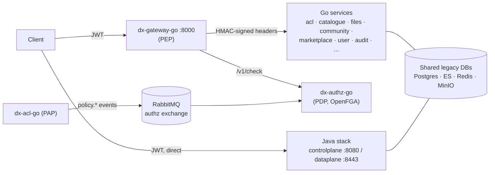

# Platform Orientation

## Learning objectives

- Clone the orchestration repo and every service repo, and boot the full stack locally.
- Run the end-to-end smoke test and a real authenticated API call.
- Explain the two-track architecture (Go and Java), the role of the gateway, and where the Go services sit.
- Know which document answers which question — before you need it.

## Prerequisites

- [Environment Setup](environment) — Go, Docker, Git installed.

## Time estimate

**4–5 hours** (includes image pulls and a guided reading tour).

## Concepts

### One orchestrator, many repos

The platform is developed as **one orchestration repository (`cdpg-claude`) with every service repo cloned inside it**. The orchestrator holds Docker Compose files, configs, and documentation; each service (e.g. `dx-acl-go`, `dx-gateway-go`) is its own Git repo, cloned into the orchestrator directory and ignored by its Git. Docker build contexts and Go `replace` directives rely on this layout — the repos must live *inside*, not as siblings.

```bash
git clone <cdpg-claude remote> && cd cdpg-claude
make dev-clone         # clones every service repo here, on dev (idempotent)
make dev-up            # boots everything (~90s cold)
make dev-init-dbs      # creates Go-service databases (first run only)
make dev-demo          # end-to-end smoke test — ALL GREEN = healthy stack
make dev-token         # fetches a JWT for the test user consumer1
```

`make dev-demo` green is **Milestone M0's gate**. If anything is red, `claude-docs/TROUBLESHOOTING.md` is the first stop.

### The two tracks



- **Go track** (the production target): every request enters through `dx-gateway-go` on **:8000**. The gateway validates the JWT, asks `dx-authz-go` (backed by **OpenFGA**) whether the call is allowed, strips the JWT, and forwards the request with **HMAC-signed identity headers**. Upstream Go services trust those headers after verifying the signature.
- **Java track** (the existing platform, still live): clients hit `controlplane` and `dataplane-rs` directly, no gateway.
- **Both tracks share infrastructure**: PostgreSQL, Redis, RabbitMQ, Elasticsearch, MinIO, Keycloak. The governing migration principle: Go services run **on the legacy databases, unchanged**, preserving the legacy API contract.

Three roles you'll hear constantly (they come from the XACML policy model):

| Term | Service | Role |
|---|---|---|
| **PEP** — Policy Enforcement Point | `dx-gateway-go` | Enforces decisions at the front door |
| **PDP** — Policy Decision Point | `dx-authz-go` | Answers "is this allowed?" via OpenFGA |
| **PAP** — Policy Administration Point | `dx-acl-go` | Where policies are created/deleted; publishes changes as events |

### Make a real call

```bash
make dev-token                       # writes a JWT to /tmp/jwt.txt
TOKEN=$(cat /tmp/jwt.txt)
curl -s http://localhost:8000/community/... -H "Authorization: Bearer $TOKEN"
```

Also worth bookmarking: Keycloak admin at `:8180` (admin/admin), RabbitMQ management UI at `:15672` (admin/admin), MinIO console at `:9003`. Test users (`consumer1`, `provider1`, `orgadmin`, …) are listed in the orchestrator's `CLAUDE.md`.

### The documentation map

You will not remember all of this — you just need to know **where to look**:

| Question | Document (in `cdpg-claude/claude-docs/`) |
|---|---|
| How does the whole system fit together? | `ARCHITECTURE.md` |
| What must my service do to be acceptable? | `GO-SERVICE-STANDARDS.md` |
| Why is it designed that way? | `GO-PLATFORM-REVIEW.md` |
| What does service X do, exactly? | `SERVICES.md` |
| How do I test? | `TESTING.md` |
| How do tokens/HMAC work? | `AUTH.md` |
| Branching, PRs, adding a service? | `CONTRIBUTING.md` |
| Something's broken | `TROUBLESHOOTING.md` |

:::info[Platform connection]
This whole page *is* the platform connection. By the end of it you have the same stack running locally that production runs — every exercise from Module 3 onward executes against it.
:::

## Exercises

1. Run `make dev-demo` and read its output carefully — identify which check exercises the gateway, which exercises RabbitMQ propagation, and which proves policy enforcement.
2. Open the RabbitMQ UI (:15672) and find the `authz` exchange. Which queues are bound to it, and with which routing keys?
3. In Keycloak (:8180), find the `iudx` realm and the `consumer1` user. Decode your `/tmp/jwt.txt` at jwt.io — identify the `iss`, `aud`, `exp`, and role claims.
4. Skim `ARCHITECTURE.md` sections 1–3 and write (for yourself) a five-sentence summary of the request flow from client to a Go service.

## Check yourself

- What are PEP, PDP, and PAP, and which service is each?
- Why does the gateway strip the JWT before forwarding, and what replaces it?
- Which databases does a typical Go service use — its own, or the legacy ones? Why?
- Where would you look first if `make dev-up` fails?

## References

- Platform: `claude-docs/QUICK-START.md`, `ARCHITECTURE.md`, `PORTS.md`, `TROUBLESHOOTING.md`
- [OpenFGA docs](https://openfga.dev/docs) — skim "What is FGA?" for now; Module 3 covers it properly
- [JWT introduction](https://jwt.io/introduction)
