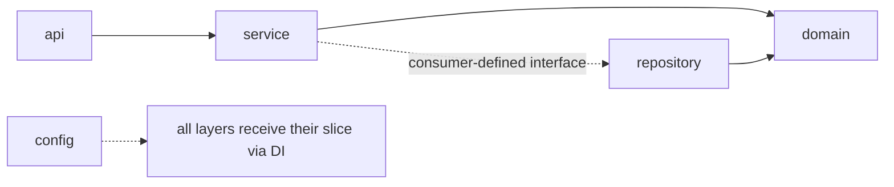

# Production-Grade Project Structure

## Learning objectives

- Lay out a Go service the platform way: `cmd/` + `internal/{config,domain,repository,service,api}`.
- Explain each layer's responsibility and the allowed dependency direction.
- Embed static assets (OpenAPI specs, SQL) with `go:embed`.
- Recognize why uniformity across 15 services is itself a feature.

## Prerequisites

- Modules 1–2 complete — especially [Packages & Modules](../module-1-go-fundamentals/packages-modules) and [Dependency Injection](../module-2-intermediate/dependency-injection).

## Time estimate

**3 hours**. From this page on, exercises run against the local stack (`make dev-up`).

## Concepts

### The canonical shape

Every DX Go service looks like this — memorize it once, navigate all fifteen:

```
dx-example-go/
├── cmd/server/
│   └── main.go              # composition root; the boot contract
├── internal/
│   ├── config/              # Config struct + Load() via dxconfig.LoadService[T]
│   ├── domain/              # entities: plain structs, business rules, no imports of layers below
│   ├── repository/postgres/ # persistence: SQL, DAO usage, row mapping
│   ├── service/             # business logic; defines the store interfaces it consumes
│   └── api/                 # handlers, router, request/response DTOs
├── openapi/                 # OpenAPI 3 spec, embedded into the binary
├── configs/config.yaml      # baked dev defaults (no secrets)
├── Dockerfile
├── .golangci.yaml
└── README.md                # API table, env vars, events, jobs
```

### Layer responsibilities and the dependency rule



- **domain** — the vocabulary: `Policy`, `AccessRequest`, statuses, invariants. Depends on nothing but stdlib.
- **repository** — translates domain to storage and back. Knows SQL; knows nothing of HTTP.
- **service** — the use cases. Orchestrates repositories, events, external clients. Defines the interfaces it needs ([Interfaces](../module-1-go-fundamentals/interfaces) — consumer side).
- **api** — HTTP in, HTTP out: decode → validate → call service → encode. **No business logic in handlers.**

Dependencies point inward (api → service → domain); nothing in `domain` imports `api`. The compiler enforces what `internal/` allows, and review enforces the rest.

### Why not other layouts?

You'll meet blog posts advocating `pkg/`, hexagonal purism, or one flat package. The platform's answer: any reasonable layout works *if everyone uses the same one*. With fifteen services, uniformity is the feature — an engineer debugging `dx-credits-go` at 2 a.m. having never opened it knows exactly where the router, the SQL, and the config live. This mirrors the standard-library philosophy: convention over configuration, boring on purpose.

Notably absent: a `pkg/` directory (services export nothing — shared code graduates to `dx-common-go` instead) and a `models/` grab-bag (entities live in `domain`, DTOs live with the layer that owns them).

### go:embed — assets inside the binary

The platform ships OpenAPI specs and schema SQL *inside* the binary — one artifact, no "file not found in the container" class of bugs:

```go
package openapi

import _ "embed"

//go:embed spec.yaml
var Spec []byte
```

```go
//go:embed schema.sql
var schemaSQL string // idempotent DDL, applied at boot ("schema ensure")
```

A test asserting the embedded spec parses (`TestEmbeddedSpecLoads` — you met it in [Testing](../module-2-intermediate/testing)) turns a corrupt asset into a build failure.

:::info[Platform connection]
Diff two real services — `dx-acl-go` and `dx-registry-go` — directory by directory: the shape is identical down to file names (`internal/api/router.go`, `internal/config/config.go`). That's GO-SERVICE-STANDARDS' "repo shape" requirement in practice, and it's what the [capstone](../capstone/capstone-service) will grade you against. The single documented deviation (`dx-files-connect-api-go`'s boot/config) is tracked as a defect to fix, not a precedent.
:::

## Exercises

1. Scaffold `dx-scratch-go` with the full canonical layout: a `Note` domain entity, an in-memory repository (Postgres comes two pages later), a service with a consumer-defined store interface, and an api layer with one GET/POST pair. Wire it per the boot contract.
2. Embed a small `spec.yaml` and write the test that it loads. Break the YAML; watch the test fail.
3. Violate the dependency rule on purpose — import `api` from `domain` — and fix it. Then move a "helper used by two layers" to its correct home and justify the choice.
4. Read `dx-acl-go`'s tree (`tree -L 3 dx-acl-go` in the workspace) and note every file the scaffold above predicted correctly.

## Check yourself

- Which layer defines the repository interface, and why that one?
- Why is there no `pkg/` in a DX service?
- What bug class does `go:embed` for specs/SQL eliminate?
- What belongs in `domain`, and what may `domain` import?

## References

- [go:embed docs](https://pkg.go.dev/embed)
- [Google Go Style Guide — Package organization](https://google.github.io/styleguide/go/best-practices#package-organization)
- Platform: GO-SERVICE-STANDARDS.md (repo shape), any two services diffed side by side
