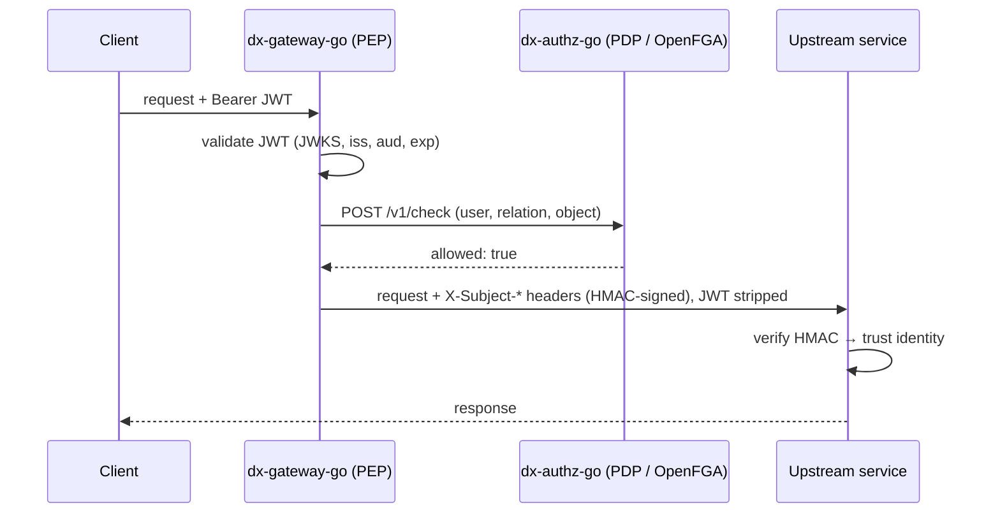

# Authentication & Authorization

## Learning objectives

- Validate JWTs correctly: RS256 signatures via JWKS, issuer/audience/expiry claims.
- Explain the platform trust model: gateway verifies once, upstreams trust HMAC-signed identity headers.
- Describe PEP/PDP/PAP and how OpenFGA answers "may this user do this to that?"
- Wire the auth resolver middleware and extract the authenticated user in a handler.

## Prerequisites

- [REST API Development](rest-api-development), [Platform Orientation](../module-0-setup/platform-orientation) (the PEP/PDP/PAP vocabulary)

## Time estimate

**5 hours**

## Concepts

### Authentication: JWTs from Keycloak

Users authenticate against **Keycloak** (OIDC Authorization Code + PKCE for browser flows) and receive a **JWT**: three base64 segments — header, claims, signature — signed with Keycloak's private key (RS256). Anyone with the **public** key verifies it offline; services never call Keycloak per request.

Verification checklist (all of it, every time):

1. **Signature** against the current public key from Keycloak's **JWKS** endpoint (`golang-jwt/jwt/v5` + `keyfunc`, keys cached and refreshed so rotation just works).
2. **`iss`** — token from *our* realm.
3. **`aud`** — token meant for *this* platform.
4. **`exp`/`iat`** — not expired (small leeway for clock skew).
5. Then extract identity: subject, email, roles, organisation.

Skipping any check is a real vulnerability, not a shortcut — e.g. skipping `aud` lets a token minted for another client impersonate users here.

### The trust model: verify once at the gateway

Per-request JWKS validation in fifteen services is wasteful and spreads security-critical code everywhere. The DX design centralizes it:



The gateway strips the JWT and forwards six headers — `X-Subject-Id`, `-Email`, `-Roles`, `-Org-Id`, `-Issued-At`, and `-Sig`, where `Sig = HMAC-SHA256(shared secret, canonical string of the others)`. Upstreams recompute the HMAC; a valid signature proves the headers were written by the gateway (only it knows the secret) and not tampered with. `Issued-At` plus a short validity window blunts replay.

The upstream **auth resolver** (`dx-common-go/auth/resolver`) chains the possibilities:

1. `X-Subject-Sig` present → verify HMAC. Valid → trust; **invalid → 401, never fall through to JWT.**
2. Else `Authorization: Bearer` → full JWT validation (services also reachable without the gateway).
3. Else → anonymous (public routes only).

Rule 1's "never fall through" matters: a forged-but-invalid HMAC must not get a second chance at a weaker path. Handlers then read the caller from context — the typed-key pattern you built in [Context](../module-2-intermediate/context):

```go
user, ok := auth.UserFrom(r.Context()) // *DxUser: ID, Email, Roles, OrganisationID
```

### Authorization: OpenFGA and ReBAC

Roles answer "is this user an admin?" — too coarse for a data exchange where the real question is *"may consumer C access dataset D?"*. The platform uses **relationship-based access control** via **OpenFGA** (a Zanzibar-style engine): authorization data is a graph of tuples like `user:alice → consumer → dataset:xyz`, and a check asks whether a path exists.

The XACML trio from Module 0, now concrete:

- **PAP** `dx-acl-go` — policy CRUD. Creating a policy ultimately means "these tuples should exist".
- **PDP** `dx-authz-go` — wraps OpenFGA; answers `POST /v1/check` in milliseconds.
- **PEP** `dx-gateway-go` — calls the PDP before proxying; denies with 403.

How tuples reach OpenFGA — via RabbitMQ events with an outbox, not direct calls — is the subject of [Event-Driven Architecture](event-driven-rabbitmq); the eventual-consistency consequences land in [Distributed Systems](distributed-systems).

:::info[Platform connection]
Everything here is running in your local stack. `make dev-token` exercises the full Keycloak flow; the `authz` exchange in the RabbitMQ UI carries the policy events; and `make dev-demo`'s deny-then-allow check (create policy → allowed within ~3s; delete → denied) is the whole model observable end to end. Sensitive admin routes additionally use `RequireGatewayOrigin()` — HMAC-or-nothing, no JWT fallback. The full write-up is `claude-docs/AUTH.md`.
:::

## Exercises

1. Decode your `make dev-token` JWT (jwt.io or `jq` on the payload segment) and identify every claim from the verification checklist.
2. Implement HMAC header signing and verification in isolation: a 20-line `sign(headers, secret)` and `verify(headers, sig, secret)` pair with a canonical-string format you define. Tamper with a header; watch verification fail. (Note how order in the canonical string matters — why?)
3. Add resolver-style middleware to `dx-scratch-go`: trust an `X-Subject-Id` header only when HMAC-valid (shared secret from config), else 401. Protect POST routes; leave GETs anonymous.
4. In the OpenFGA playground (or the local instance), model `user → consumer → dataset` and run checks for a granted and an ungranted pair.
5. Curl a gateway-protected endpoint three ways: no token (401), valid token without a policy (403), valid token with a policy (200). Explain which component produced each status.

## Check yourself

- Why does the gateway strip the JWT instead of forwarding it?
- What exactly does a valid `X-Subject-Sig` prove, and to whom?
- Why must an invalid HMAC hard-fail rather than fall back to JWT validation?
- What can ReBAC express that role checks can't?

## References

- [JWT RFC 7519](https://datatracker.ietf.org/doc/html/rfc7519) · [JWKS RFC 7517](https://datatracker.ietf.org/doc/html/rfc7517)
- [OpenFGA docs](https://openfga.dev/docs) · [Google Zanzibar paper](https://research.google/pubs/pub48190/)
- Platform: `claude-docs/AUTH.md`; `dx-common-go/auth/{jwt,resolver}`
