# Database Access Patterns

## Learning objectives

- Connect to Postgres with the platform pool factory and understand what pooling buys.
- Write parameterized queries — and explain why identifiers can never be parameters.
- Implement the repository pattern with struct-tag row mapping and **embed `repository.Base[R]`** to add only domain methods.
- Query with the **fluent DSL** and **specification constructors** — including joins, `GroupBy`/`Having`, pagination with `FindPage`.
- Use bulk operations, optimistic locking, soft deletes, and audit columns where they apply.
- Run schema migrations the platform way (embedded SQL files, `migrate.Run`/`migrate.Status`).
- Know when a query has outgrown the DSL, and reach for SQLC correctly when it has. State the **builder-vs-raw rule** (the "R2 exception").
- Handle `pgx.ErrNoRows` and soft-deletes correctly.

## Prerequisites

- [Project Structure](project-structure) (repository layer), [Generics](../module-1-go-fundamentals/generics)

## Time estimate

**6 hours**

## Concepts

### The layered stack — what sits on what

The platform talks to Postgres with **pgx v5** — deliberately **no ORM** (no GORM, no ent: they fight the platform on schema ownership and on Postgres features like JSONB/PostGIS, exactly where we need SQL most). What you get instead is a thin, typed stack in `dx-common-go/database/postgres`:

```mermaid
flowchart TB
    S[service repository<br/>embeds Base — domain methods ONLY] --> B
    B[repository.Base&#91;R&#93;<br/>tx-aware generic CRUD + fluent Query] --> D
    B -.->|"Select / Exec — raw escape hatch"| P
    D[dao.BaseDAO&#91;T&#93;<br/>CRUD, Page, soft delete, versioning, bulk] --> Q
    Q[query builder + spec constructors<br/>SQL text, $N placeholders] --> P
    P[pgx v5 pool<br/>postgres.NewPool] --> PG[(PostgreSQL)]
```



Each layer is optional downward — you can always drop a level — but the default entry point for a service is the top.

### pgx and the pool

One pool per service, created at boot via the platform factory (a hard dependency — `Fatal` if unreachable), *after* [migrations](schema-migrations) have run:

```go
pool, err := postgres.NewPool(cfg.Postgres) // dx-common-go: sizing, timeouts, ping
if err != nil { logger.Fatal("connect postgres", zap.Error(err)) }
defer pool.Close()
```

The pool hands out connections per query and reclaims them; you tune `max_conns`/`min_conns` in config. Every query takes `ctx` — cancellation and timeouts propagate to the database ([Context](../module-2-intermediate/context) paying off again).

`NewPool` also takes variadic `PoolOption`s — `WithTracers(...)` installs a `pgx.QueryTracer` (OTel spans, slow-query logging) without touching the rest of your config, which is how [Observability](../module-3-advanced/observability) wires distributed tracing onto every query for free.

### Parameterized SQL — values yes, identifiers never

```go
row := pool.QueryRow(ctx,
	`SELECT id, user_id, item_id, expires_at
	   FROM policies WHERE id = $1`, id)
```

Placeholders (`$1`) send values out-of-band — SQL injection becomes structurally impossible for values. But placeholders **cannot** carry identifiers (table names, columns, `ORDER BY` keys). Dynamic identifiers must come from a **code-side allowlist** — the query builder does this for you (its column names are written by you, never by the caller), and raw SQL must do it by hand (see `pgEscape` in dx-dataplane-ogc-go for the pattern).

### The repository pattern — embed, don't reimplement

A service repository **embeds** the shared generic base and contains *only* domain-specific methods. This is Go's composition answer to Spring Data's base repositories — no inheritance, no reflection, promoted methods resolved at compile time:

```go
// The whole struct. Everything generic is promoted from Base.
type AccessRequestRepo struct {
	*repository.Base[requestRow]
}

func NewAccessRequestRepo(pool *pgxpool.Pool) *AccessRequestRepo {
	return &AccessRequestRepo{Base: repository.New[requestRow](pool, "request",
		dao.WithIDColumn[requestRow]("request_id"))}
}

// Domain-specific methods only:
func (r *AccessRequestRepo) PendingExists(ctx context.Context, itemID, consumerID uuid.UUID) (bool, error) {
	return r.Query(ctx).Where(
		query.Eq("item_id", itemID),
		query.Eq("consumer_id", consumerID),
		query.Eq("status", "PENDING"),
	).Exists(ctx)
}
```

<<<<<<< HEAD
Row types map by `db` tags (pgx's `RowToStructByNameLax` under the hood); nullable columns are pointer fields so `NULL` scans cleanly:

```go
type requestRow struct {
	ID        uuid.UUID  `db:"request_id"`
	Status    string     `db:"status"`
	ExpiryAt  *time.Time `db:"expiry_at"`   // nullable → pointer
	CreatedAt time.Time  `db:"created_at"`
}
```

Two shapes, one rule:

- **Single-domain repo → embed** `*repository.Base[row]` (methods promoted).
- **Multi-domain repo → named fields** (`balances *repository.Base[balanceRow]`, `requests *repository.Base[requestRow]`) — embedding two bases makes every promoted name ambiguous.
- If a domain method shadows a promoted name (your `Upsert(ctx, *Merchant)` vs the generic `Upsert`), delegate explicitly: `r.Base.Upsert(...)`.

Every `Base` method is **transaction-propagation-aware**: if the context carries a transaction (next page), the call joins it automatically. Repositories contain zero transaction code.

### Querying: fluent DSL + specification constructors

Two equivalent front-ends produce the same safe SQL; use whichever reads better:

```go
// Fluent chain (criteria-style):
rows, err := r.Query(ctx).
	Where(query.Eq("status", "PENDING"), query.Gte("created_at", from)).
	OrderByDesc("updated_at").
	Limit(20).Offset(0).
	Find(ctx)                        // terminals: Find / One / Count / Exists / Page

// Specification pattern (predicates as composable values):
conds := query.And(
	query.Eq("status", "PENDING"),
	query.In("asset_type", types),
	query.Between("created_at", from, to),
)
```

Specs shine when predicates are built up across functions — a filter struct converts to `[]query.Condition` and the list endpoint becomes one chain:

```go
page, err := r.Query(ctx).
	Where(f.conditions(principal)...).
	OrderByDesc("updated_at").
	Limit(limit).Offset(offset).
	Page(ctx)                        // *dao.Page[R]: Data, Total, HasNext
```

### Pagination, filtering, sorting

`Page(ctx)` / `FindPage` return `Page[T]{Data, Total, Limit, Offset, HasNext}` — the envelope your list handlers serialize. Filters come from the HTTP layer via allowlisted params ([REST API Development](rest-api-development)); sorting columns are code-side names, never raw user input. Clamp limits in the repository (`if limit <= 0 || limit > 1000 { limit = 50 }`) — the platform convention.

### Bulk operations

Three tiers, by volume:

```go
r.InsertMany(ctx, cols, rows)   // one multi-VALUES statement — tens to hundreds
r.CopyFrom(ctx, cols, rows)     // COPY protocol — thousands+, the fast path
r.UpdateByIDs(ctx, ids, set)    // one UPDATE ... WHERE id IN (...)
r.DeleteByIDs(ctx, ids)
```

### Optimistic locking

For read-modify-write races without holding row locks — `UpdateVersioned` applies the change only if the version column still matches, incrementing it atomically:

```go
row, err := r.UpdateVersioned(ctx,
	map[string]any{"status": "APPROVED"},
	[]query.Condition{query.Eq("id", id)},
	"version", expectedVersion)
if errors.Is(err, dao.ErrStaleVersion) {
	// somebody else won — reload and decide
}
```

(Pessimistic alternative for money-like invariants: raw `SELECT ... FOR UPDATE` inside a transaction — see dx-credits-go's ledger.)

### Soft deletes

Opt-in at construction; then **every read filters automatically**:

```go
base := repository.New[noteRow](pool, "notes",
	dao.WithSoftDeleteFilter[noteRow]("status"))   // reads exclude status = 'DELETED'

base.SoftDelete(ctx, id)          // marks deleted
base.Restore(ctx, id)             // reverses it
base.Unscoped().Query(ctx)...     // admin view: include deleted rows
base.HardDelete(ctx, conds)       // permanent
```

The automatic filter is the point: a *forgotten* `deleted_at IS NULL` in hand-written SQL resurrects deleted data — in a policy table that's a security bug. With the filter in the DAO, forgetting is no longer possible on the generic path; your raw SQL must still remember.

### Audit columns

Also opt-in — map-based writes stamp who did it, from the request context:

```go
base := repository.New[docRow](pool, "documents",
	dao.WithAuditColumns[docRow]("created_by", "updated_by"))

// middleware, once per request:
ctx = dao.WithActor(ctx, user.ID)

// every InsertMap/Update/Upsert now auto-populates the audit columns;
// values you set explicitly always win.
```

**Platform caveat:** this applies only to tables your service *owns* — legacy tables are Flyway-owned ([Schema Migrations](schema-migrations)) and can't gain columns; there, the event-based audit pipeline is the record.

### The builder-vs-raw rule (the "R2 exception")

The division of labor, enforced in review:

- **Base + DSL is the default.** Anything it can express, it must express — hand-written SQL for a single-table lookup is a review finding.
- **Raw parameterized SQL is *sanctioned*** for what a column-oriented builder can't say: multi-table JOINs, JSONB predicates, PostGIS functions, CTEs, window functions, `FOR UPDATE SKIP LOCKED`. Raw queries still use `$N` placeholders, declarative row structs (`pgx.RowToStructByPos` — never hand-written `Scan` boilerplate), the shared error translator, and a comment stating *why* they're raw.

Worked examples of each side, in one service: `dx-acl-go/internal/repository/postgres/access_request_repo.go` (all DSL) vs `policy_repo.go` (raw by rule).

### Errors — one translator

All database failures pass through `errors.MapPostgresError` (the DAO does this for you): no-rows → NotFound (404), unique violation → Conflict (409), FK/not-null/check → Validation (400), serialization/deadlock → Database (500). Repositories translate to their own sentinels at the boundary when the service layer expects them (`ErrRequestNotFound`), and handlers never see pgx errors.

### Testing repositories

The platform pattern is **DSN-gated integration tests** against a real Postgres (the local stack's, or a scratch container):

```go
func TestRepo_Integration(t *testing.T) {
	dsn := os.Getenv("DX_TEST_POSTGRES_DSN")
	if dsn == "" { t.Skip("set DX_TEST_POSTGRES_DSN to run") }

	// provision through the real migration runner — the same path production takes
	err := dxmigrate.Run(dxmigrate.Config{DSN: dsn}, svcdb.Migrations, "migrations", zap.NewNop())
	...
}
```

`docker run -e POSTGRES_PASSWORD=pg -p 5433:5432 postgres:16` gives you a scratch instance; [Testcontainers-go](https://golang.testcontainers.org/) automates the same idea per-test if you prefer managed lifecycles. Either way the principle holds: **repositories are tested against Postgres, not mocks** — the SQL is the thing under test. Pure logic around repositories (filters → conditions, row → domain mapping) gets ordinary unit tests. See `dx-marketplace-go/internal/repository/postgres/repo_integration_test.go` for the live example.

:::info[Platform connection]
`dx-common-go/database/postgres` holds the whole stack: `NewPool`, `repository/base.go` (embed this), `dao/` (`BaseDAO[T]`, the fluent `Finder`, options), `query/` (builder + spec constructors), `migrate/` (the [migrations runner](schema-migrations)). Schema note: Go services issue **no DDL outside their versioned migrations**, and never any against Flyway-owned legacy tables. Every Postgres service in the fleet — acl, ogc, marketplace, credits, registry, subscription, audit, user, files-connect, community-layer — follows this page's pattern; any of them is a worked example.
=======
This is the resolution of the whitelist rule from [REST API Development](rest-api-development) — user input picks *among* identifiers you wrote; it never *is* the identifier. Every platform DSL you'll see below (`query.Condition`, `query.Join`, `Finder.GroupBy`) follows this exact rule: **values are always bound parameters; column/table/join text is always code-authored, never user input.**

### The persistence stack, package by package

`dx-common-go`'s data layer is five small packages, all nested under `database/postgres` (Postgres-specific code stays under the backend it belongs to — `database/redis` and `database/elastic` are the other backends, each with their own client code, not sharing this one), each with one job — no single "god package" to learn:

| Package | Job |
|---|---|
| `database/postgres/client` | Pool factory, pool config, pgx tracer composition (`MultiTracer`, `SlowQueryTracer`) |
| `database/postgres/transaction` | `WithTransaction`/`InTransaction` (context-propagated), retry-on-serialization-failure, advisory locks |
| `database/postgres/dao` | `BaseDAO[T]` — the generic CRUD engine, and `Finder[T]` — the fluent query DSL built on top of it |
| `database/postgres/query` | The DSL's building blocks: `Condition`, `Join`, `SelectQuery`, and the `SQLBuilder` that renders them to SQL |
| `database/postgres/repository` | `Base[R]` — an embeddable wrapper around `BaseDAO[T]` for service repositories, plus `migrate/` for schema migrations |

You'll rarely import `query` directly except for its typed constructors (`query.Eq`, `query.Gt`, …); everything else flows through `dao`/`repository`.

### Repositories and row mapping — the raw layer, so you know what's underneath

Before the generic layer, it's worth seeing what it's built on. pgx v5's collection helpers map rows by `db` tags — the reflection-inside-a-library pattern from [Module 1](../module-1-go-fundamentals/reflection-and-when-not):

```go
type Note struct {
	ID        string    `db:"id"`
	Title     string    `db:"title"`
	CreatedAt time.Time `db:"created_at"`
}

rows, err := pool.Query(ctx, `SELECT id, title, created_at FROM notes WHERE user_id = $1`, uid)
if err != nil {
	return nil, fmt.Errorf("query notes: %w", err)
}
notes, err := pgx.CollectRows(rows, pgx.RowToStructByName[Note])
```

Absence is an error value, not an exception: single-row lookups return `pgx.ErrNoRows`, which the repository translates to the platform taxonomy — `errors.Is(err, pgx.ErrNoRows)` → `dxerrors.NewNotFound(...)`. Handlers never see pgx errors. `BaseDAO` (below) does this translation for you via `dao.MapPgError`.

### `repository.Base[R]` — the embeddable generic repository

CRUD, pagination, and soft-delete plumbing is identical for every entity, so `dx-common-go` provides it once, generically. A service repository **embeds** `*repository.Base[R]` and adds only domain-specific methods:

```go
type NoteRepo struct {
	*repository.Base[Note]
}

func NewNoteRepo(pool *pgxpool.Pool) *NoteRepo {
	return &NoteRepo{Base: repository.New[Note](pool,
		repository.WithTable[Note]("notes"),
		repository.WithID[Note]("id"))}
}

// domain-specific queries only — everything generic is already on Base:
func (r *NoteRepo) ByUser(ctx context.Context, userID string) ([]Note, error) {
	return r.Query(ctx).Where(query.Eq("user_id", userID)).OrderByDesc("created_at").Find(ctx)
}
```

`repository.New` is options-based, not positional — `WithTable`/`WithID` (or `WithDAOOption` for anything `dao.Option` already exposes, like `dao.WithSoftDeleteFilter`). One Go-generics wrinkle worth knowing cold: **`WithTable`/`WithID` need the explicit type argument** — `repository.WithTable[Note](...)`, not `repository.WithTable(...)` — because Go cannot infer a generic function's type parameter across a nested call like `New[Note](pool, WithTable(...))`. This is a hard language constraint (no bidirectional/expected-type inference in Go generics), not a style choice, and it's exactly the kind of thing [Generics](../module-1-go-fundamentals/generics) warns you to expect once you start composing generic functions.

If your entity can describe its own table, skip the options entirely:

```go
func (Note) TableName() string { return "notes" }
func (Note) IDColumn() string  { return "id" }

repo := repository.New[Note](pool) // infers table/ID from the methods above
```

`Base[R]` promotes the full generic surface — `FindByID`, `FindAll`, `FindPage`, `Insert`/`InsertMap`/`InsertIgnore`, `Update`/`UpdateReturning`, `UpdateVersioned` (optimistic locking), `SoftDelete`/`Restore`, `HardDelete`, `InsertMany`/`CopyFrom` (bulk), and raw `Select`/`SelectOne`/`Exec` escape hatches — every one of them transaction-propagation-aware (see [Transactions](transactions)).

### The `Finder` DSL — fluent queries, including joins and aggregation

`Base[R].Query(ctx)` (or `dao.BaseDAO[T].Query()` directly) returns a `Finder[T]` — a chainable builder ending in `Find`/`One`/`Count`/`Exists`/`Page`:

```go
notes, err := repo.Query(ctx).
	Where(query.Eq("user_id", uid), query.Gt("created_at", since)).
	OrderByDesc("created_at").
	Limit(20).
	Find(ctx)
```

Conditions compose from typed constructors (`query.Eq`, `query.Gt`, `query.In`, `query.Between`, …) — values always ride as bound parameters, exactly like the raw-SQL section above.

**Joins.** `Finder.Join` appends a static SQL join; `Finder.Select` sets an explicit column list (required once you join, so each side can `COALESCE` its own nullable columns — there's no implicit `table.*`):

```go
type noteWithAuthor struct {
	ID         string `db:"id"`
	Title      string `db:"title"`
	AuthorName string `db:"author_name"`
}

rows, err := dao.NewBaseDAO[noteWithAuthor](pool, "notes").
	Query().
	Join(query.Join{Type: "LEFT", Table: "users AS u", On: "notes.user_id = u.id"}).
	Select("notes.id", "notes.title", "COALESCE(u.name, '') AS author_name").
	Where(query.Eq("notes.id", id)).
	One(ctx)
```

**Aggregation.** `GroupBy`/`Having` render exactly where SQL expects them (`WHERE ... GROUP BY ... HAVING ...`), using the same `Condition` model as `Where`:

```go
type userNoteCount struct {
	UserID string `db:"user_id"`
	Total  int64  `db:"total"`
}

busy, err := dao.NewBaseDAO[userNoteCount](pool, "notes").
	Query().
	Select("user_id", "COUNT(*) AS total").
	GroupBy("user_id").
	Having(query.Gt("total", 5)).
	Find(ctx)
```

`GroupBy`/`Having` apply to `Find`/`One`/`Page` — not `Count`/`Exists`, which assume a single scalar/existence result a grouped query doesn't produce.

Where the DSL stops on purpose: **no CTEs, no window functions as a first-class construct, no multi-level subqueries.** Window functions actually work today as plain column expressions (`Select("ROW_NUMBER() OVER (...) AS rn")` is just a string), but anything needing a `WITH` clause is where you reach for SQLC — see below.

### Migrations

Services own their **net-new** tables via versioned, embedded SQL migrations — `dx-common-go/database/postgres/migrate`. Legacy/shared tables stay owned by whatever already owns them (Flyway, in this platform); `migrate` never issues DDL against those, only against a service's own additions.

Scaffold a migration pair with the platform CLI:

```bash
go run github.com/datakaveri/dx-common-go/cmd/dx new migration add_notes_table
# → db/migrations/0001_add_notes_table.up.sql
# → db/migrations/0001_add_notes_table.down.sql
```

Write plain SQL in each file, then embed and run them at boot:

```go
//go:embed db/migrations/*.sql
var migrations embed.FS

if err := migrate.Run(migrate.Config{
	Mode:      cfg.SchemaMode, // migrate.ModeMigrate or migrate.ModeNone
	DSN:       cfg.Postgres.DSN,
	TableName: "schema_migrations_notes", // one history table per service, shared DB stays collision-free
}, migrations, "db/migrations", logger); err != nil {
	logger.Fatal("apply schema migrations", zap.Error(err))
}
```

`migrate.Run` is a no-op when `Mode != ModeMigrate`, so you can call it unconditionally from `main` and gate real execution purely through config — the same "always call it, config decides if it does anything" shape as `observability.Init` in [Observability](observability). `migrate.Status` reports the current version/dirty flag without applying anything — use it for a boot-time "refuse to start if the DB is ahead of this binary" check. A dirty migrations table (a prior migration failed partway through) surfaces as a typed `*migrate.DirtyStateError` naming the exact version — never swallow it and boot anyway; fix the schema by hand, then `migrate force <version>`.

### SQLC — for the query the DSL can't express

The three-legged rule the platform actually uses, in order:

1. **CRUD, filtered lists, pagination, simple joins, `GROUP BY`/`HAVING`** → `Finder`. This is the default; reach for it first.
2. **A query needing a CTE, a window function used for filtering (not just as a plain column), a recursive query, or genuinely complex reporting SQL** → **SQLC**.
3. **Something so one-off it isn't worth a generated function at all** → the raw `Select`/`SelectOne`/`Exec` escape hatches on `BaseDAO`/`Base[R]` — still parameterized, still going through the same error translation.

SQLC generates typed Go functions from checked-in `.sql` files — compile-time-checked against a real schema snapshot, zero hand-written `Scan` code, and (crucially) **nothing about the generated code is hidden**: you can go-to-definition into it like any other package. Scaffold the canonical layout:

```bash
go run github.com/datakaveri/dx-common-go/cmd/dx sqlc init
# → sqlc.yaml, db/sqlc/schema.sql (paste your reference schema here), db/sqlc/queries/
```

A concrete case the `Finder` genuinely can't do — "the 3 most recent notes per user" (top-N-per-group needs a window function *filtered on*, which requires a CTE to wrap it):

```sql
-- db/sqlc/queries/notes.sql
-- name: RecentNotesPerUser :many
WITH ranked AS (
    SELECT
        id, user_id, title, created_at,
        ROW_NUMBER() OVER (PARTITION BY user_id ORDER BY created_at DESC) AS rn
    FROM notes
    WHERE deleted_at IS NULL
)
SELECT id, user_id, title, created_at
FROM ranked
WHERE rn <= $1
ORDER BY user_id, created_at DESC;
```

```bash
go run github.com/sqlc-dev/sqlc/cmd/sqlc@v1.27.0 generate
```

Wire the generated `Queries` type through `sqlcx.DB` so it stays **transaction-propagation-aware** just like `Finder` — a generated query joins the same ambient transaction a `Base[R]` call would:

```go
import (
	"github.com/datakaveri/dx-common-go/database/postgres/sqlcx"
	sqlcgen "yourmodule/internal/repository/postgres/sqlcgen"
)

q := sqlcgen.New(sqlcx.DB(ctx, pool))
recent, err := q.RecentNotesPerUser(ctx, 3)
```

If a repository needs SQLC access *alongside* the generic CRUD surface, `repository.NewWithSQL[R, Q]` attaches it as a typed accessor rather than a second, disconnected object:

```go
type NoteRepo struct {
	*repository.BaseWithSQL[Note, *sqlcgen.Queries]
}

func NewNoteRepo(pool *pgxpool.Pool) *NoteRepo {
	return &NoteRepo{BaseWithSQL: repository.NewWithSQL[Note, *sqlcgen.Queries](
		pool, sqlcgen.New(sqlcx.DB(context.Background(), pool)),
		repository.WithTable[Note]("notes"))}
}

func (r *NoteRepo) Recent(ctx context.Context, n int32) ([]sqlcgen.RecentNotesPerUserRow, error) {
	return r.SQL().RecentNotesPerUser(ctx, n) // generic CRUD is still there: r.FindByID(...), r.Query(ctx)...
}
```

What SQLC is **not** for: plain CRUD, `Exists`/`Count`, dynamic `WHERE` clauses (SQLC's queries are static — it can't express "maybe filter by status, maybe not" the way `Finder.Where` can), or anything `GroupBy`/`Having` already covers. Reaching for SQLC when `Finder` would do is exactly the kind of premature-abstraction/wrong-tool call the platform standards flag in review.

### Soft deletes

Platform tables use `deleted_at`/status-sentinel columns rather than hard `DELETE`s (audit trails, undelete). The catch: **every read must filter** it out — explicitly. A forgotten filter resurrects deleted data, which in a policy table is a security bug, not a cosmetic one. `dao.WithSoftDeleteFilter("status")` (passed via `repository.WithDAOOption` or directly to `dao.NewBaseDAOWith`) makes every `Find*`/`Count` call on that DAO auto-exclude deleted rows; `Unscoped()` bypasses it for one call chain (an admin "show deleted" view); `Restore` reverses it. Your raw SQL and any SQLC query must remember the filter themselves — the generic layer can't protect what it doesn't touch.

:::info[Platform connection]
`dx-common-go/database/{client,transaction,postgres}` holds all of it. Read `database/postgres/dao/base.go` top to bottom first — it's short and it's the generics page made real — then `database/postgres/repository/base.go` (the embeddable wrapper) and `database/postgres/dao/finder.go` (the fluent DSL, including `Join`/`Select`/`GroupBy`/`Having`). Schema note: Go services run against the **legacy databases** with the Java stack's Flyway as schema owner for shared tables — Go code issues no DDL against those, only versioned migrations for its own net-new additions. `claude-docs/DATABASE.md` maps every table to its owning service.
>>>>>>> 14e4022 (data base related changes)
:::

## Exercises

*(Local stack up — use its Postgres, or `docker run postgres:16` for scratch space.)*

1. Give `dx-scratch-go` a real repository the platform way: versioned baseline migration, a `noteRow` with db tags, a one-line struct embedding `repository.Base[noteRow]`, and CRUD endpoints wired through it. No hand-written SQL anywhere. Confirm `ErrNoRows` → NotFound translation via `dao.MapPgError`.
2. Attack yourself: write the vulnerable string-concatenation version of a search endpoint in a throwaway branch, inject `' OR '1'='1` through curl, then fix it with the query DSL and watch the injection become a literal string match.
3. Build the list endpoint: a filter struct → spec constructors → `Query(ctx).Where(...).OrderByDesc(...).Page(ctx)`, with allowlisted sort keys and clamped limits. Then add a `Finder`-based join: notes plus their author's display name, using `Join` + `Select` with `COALESCE`.
4. Add a `GroupBy`/`Having` query — notes-per-user counts, only users with more than N notes.
5. Add soft deletes via `WithSoftDeleteFilter` + a `Restore` endpoint, and one test proving a soft-deleted note is invisible to every list and get — then visible again through `Unscoped()`.
6. Add optimistic locking: a `version` column (new migration!), `UpdateVersioned` on edit, and a test where two concurrent edits produce exactly one winner and one `ErrStaleVersion`.
7. Write one SQLC query that's genuinely beyond the DSL — top-N-per-group (recent notes per user) or a `CTE`-based report — generate it, and call it through `sqlcx.DB` so it participates in the same transaction propagation.
8. Convert one method to raw SQL *legitimately* (add a JOIN to a second table), following all four raw-SQL guardrails — then explain why the DSL couldn't express it.

## Check yourself

- Why can `$1` carry `WHERE user_id = ?` but not `ORDER BY ?` — and which layer guards each in this stack?
- Where do pgx errors stop existing, and what replaces them?
- What does embedding `repository.Base[R]` buy over holding a `*dao.BaseDAO[R]` field? (Two answers: one about code, one about transactions.)
- Why do `WithTable[Note](...)` and `WithID[Note](...)` need an explicit type argument, and what Go language rule forces that?
- What's the platform's three-legged rule for choosing `Finder` vs SQLC vs raw SQL — and what's the one thing SQLC should never be used for?
- When is raw SQL allowed, and what four rules still apply to it?
- Why is the soft-delete filter *automatic* rather than a documented convention?
- Why are repositories tested against real Postgres instead of mocks?
>>>>>>> 14e4022 (data base related changes)

## References

- [pgx v5 docs](https://pkg.go.dev/github.com/jackc/pgx/v5) · [pgxpool](https://pkg.go.dev/github.com/jackc/pgx/v5/pgxpool)
- [OWASP: SQL Injection Prevention](https://cheatsheetseries.owasp.org/cheatsheets/SQL_Injection_Prevention_Cheat_Sheet.html)
- [SQLC](https://docs.sqlc.dev/) · [Testcontainers for Go](https://golang.testcontainers.org/)
- Platform: `dx-common-go/database/{client,postgres/{dao,query,repository,transaction,migrate,sqlcx}}`; `claude-docs/DATABASE.md`; next pages: [Schema Migrations](schema-migrations) → [Transactions](transactions)
