# Database Access Patterns

## Learning objectives

- Connect to Postgres with the platform pool factory and understand what pooling buys.
- Write parameterized queries — and explain why identifiers can never be parameters.
- Build a service repository by **embedding `repository.Base[R]`** and adding only domain methods.
- Query with the **fluent DSL** and **specification constructors**; page, filter, and sort with `FindPage`.
- Use bulk operations, optimistic locking, soft deletes, and audit columns where they apply.
- State the **builder-vs-raw rule** (the "R2 exception") and apply it in review.

## Prerequisites

- [Project Structure](project-structure) (repository layer), [Generics](../module-1-go-fundamentals/generics)

## Time estimate

**6 hours**

## Concepts

### The layered stack — what sits on what

The platform talks to Postgres with **pgx v5** — deliberately **no ORM** (no GORM, no ent: they fight the platform on schema ownership and on Postgres features like JSONB/PostGIS, exactly where we need SQL most). What you get instead is a thin, typed stack in `dx-common-go/database/postgres`:

```mermaid
flowchart TB
    S[service repository<br/>embeds Base — domain methods ONLY] --> B
    B[repository.Base&#91;R&#93;<br/>tx-aware generic CRUD + fluent Query] --> D
    B -.->|"Select / Exec — raw escape hatch"| P
    D[dao.BaseDAO&#91;T&#93;<br/>CRUD, Page, soft delete, versioning, bulk] --> Q
    Q[query builder + spec constructors<br/>SQL text, $N placeholders] --> P
    P[pgx v5 pool<br/>postgres.NewPool] --> PG[(PostgreSQL)]
```



Each layer is optional downward — you can always drop a level — but the default entry point for a service is the top.

### pgx and the pool

One pool per service, created at boot via the platform factory (a hard dependency — `Fatal` if unreachable), *after* [migrations](schema-migrations) have run:

```go
pool, err := postgres.NewPool(cfg.Postgres) // dx-common-go: sizing, timeouts, ping
if err != nil { logger.Fatal("connect postgres", zap.Error(err)) }
defer pool.Close()
```

The pool hands out connections per query and reclaims them; you tune `max_conns`/`min_conns` in config. Every query takes `ctx` — cancellation and timeouts propagate to the database ([Context](../module-2-intermediate/context) paying off again).

### Parameterized SQL — values yes, identifiers never

```go
row := pool.QueryRow(ctx,
	`SELECT id, user_id, item_id, expires_at
	   FROM policies WHERE id = $1`, id)
```

Placeholders (`$1`) send values out-of-band — SQL injection becomes structurally impossible for values. But placeholders **cannot** carry identifiers (table names, columns, `ORDER BY` keys). Dynamic identifiers must come from a **code-side allowlist** — the query builder does this for you (its column names are written by you, never by the caller), and raw SQL must do it by hand (see `pgEscape` in dx-dataplane-ogc-go for the pattern).

### The repository pattern — embed, don't reimplement

A service repository **embeds** the shared generic base and contains *only* domain-specific methods. This is Go's composition answer to Spring Data's base repositories — no inheritance, no reflection, promoted methods resolved at compile time:

```go
// The whole struct. Everything generic is promoted from Base.
type AccessRequestRepo struct {
	*repository.Base[requestRow]
}

func NewAccessRequestRepo(pool *pgxpool.Pool) *AccessRequestRepo {
	return &AccessRequestRepo{Base: repository.New[requestRow](pool, "request",
		dao.WithIDColumn[requestRow]("request_id"))}
}

// Domain-specific methods only:
func (r *AccessRequestRepo) PendingExists(ctx context.Context, itemID, consumerID uuid.UUID) (bool, error) {
	return r.Query(ctx).Where(
		query.Eq("item_id", itemID),
		query.Eq("consumer_id", consumerID),
		query.Eq("status", "PENDING"),
	).Exists(ctx)
}
```

Row types map by `db` tags (pgx's `RowToStructByNameLax` under the hood); nullable columns are pointer fields so `NULL` scans cleanly:

```go
type requestRow struct {
	ID        uuid.UUID  `db:"request_id"`
	Status    string     `db:"status"`
	ExpiryAt  *time.Time `db:"expiry_at"`   // nullable → pointer
	CreatedAt time.Time  `db:"created_at"`
}
```

Two shapes, one rule:

- **Single-domain repo → embed** `*repository.Base[row]` (methods promoted).
- **Multi-domain repo → named fields** (`balances *repository.Base[balanceRow]`, `requests *repository.Base[requestRow]`) — embedding two bases makes every promoted name ambiguous.
- If a domain method shadows a promoted name (your `Upsert(ctx, *Merchant)` vs the generic `Upsert`), delegate explicitly: `r.Base.Upsert(...)`.

Every `Base` method is **transaction-propagation-aware**: if the context carries a transaction (next page), the call joins it automatically. Repositories contain zero transaction code.

### Querying: fluent DSL + specification constructors

Two equivalent front-ends produce the same safe SQL; use whichever reads better:

```go
// Fluent chain (criteria-style):
rows, err := r.Query(ctx).
	Where(query.Eq("status", "PENDING"), query.Gte("created_at", from)).
	OrderByDesc("updated_at").
	Limit(20).Offset(0).
	Find(ctx)                        // terminals: Find / One / Count / Exists / Page

// Specification pattern (predicates as composable values):
conds := query.And(
	query.Eq("status", "PENDING"),
	query.In("asset_type", types),
	query.Between("created_at", from, to),
)
```

Specs shine when predicates are built up across functions — a filter struct converts to `[]query.Condition` and the list endpoint becomes one chain:

```go
page, err := r.Query(ctx).
	Where(f.conditions(principal)...).
	OrderByDesc("updated_at").
	Limit(limit).Offset(offset).
	Page(ctx)                        // *dao.Page[R]: Data, Total, HasNext
```

### Pagination, filtering, sorting

`Page(ctx)` / `FindPage` return `Page[T]{Data, Total, Limit, Offset, HasNext}` — the envelope your list handlers serialize. Filters come from the HTTP layer via allowlisted params ([REST API Development](rest-api-development)); sorting columns are code-side names, never raw user input. Clamp limits in the repository (`if limit <= 0 || limit > 1000 { limit = 50 }`) — the platform convention.

### Bulk operations

Three tiers, by volume:

```go
r.InsertMany(ctx, cols, rows)   // one multi-VALUES statement — tens to hundreds
r.CopyFrom(ctx, cols, rows)     // COPY protocol — thousands+, the fast path
r.UpdateByIDs(ctx, ids, set)    // one UPDATE ... WHERE id IN (...)
r.DeleteByIDs(ctx, ids)
```

### Optimistic locking

For read-modify-write races without holding row locks — `UpdateVersioned` applies the change only if the version column still matches, incrementing it atomically:

```go
row, err := r.UpdateVersioned(ctx,
	map[string]any{"status": "APPROVED"},
	[]query.Condition{query.Eq("id", id)},
	"version", expectedVersion)
if errors.Is(err, dao.ErrStaleVersion) {
	// somebody else won — reload and decide
}
```

(Pessimistic alternative for money-like invariants: raw `SELECT ... FOR UPDATE` inside a transaction — see dx-credits-go's ledger.)

### Soft deletes

Opt-in at construction; then **every read filters automatically**:

```go
base := repository.New[noteRow](pool, "notes",
	dao.WithSoftDeleteFilter[noteRow]("status"))   // reads exclude status = 'DELETED'

base.SoftDelete(ctx, id)          // marks deleted
base.Restore(ctx, id)             // reverses it
base.Unscoped().Query(ctx)...     // admin view: include deleted rows
base.HardDelete(ctx, conds)       // permanent
```

The automatic filter is the point: a *forgotten* `deleted_at IS NULL` in hand-written SQL resurrects deleted data — in a policy table that's a security bug. With the filter in the DAO, forgetting is no longer possible on the generic path; your raw SQL must still remember.

### Audit columns

Also opt-in — map-based writes stamp who did it, from the request context:

```go
base := repository.New[docRow](pool, "documents",
	dao.WithAuditColumns[docRow]("created_by", "updated_by"))

// middleware, once per request:
ctx = dao.WithActor(ctx, user.ID)

// every InsertMap/Update/Upsert now auto-populates the audit columns;
// values you set explicitly always win.
```

**Platform caveat:** this applies only to tables your service *owns* — legacy tables are Flyway-owned ([Schema Migrations](schema-migrations)) and can't gain columns; there, the event-based audit pipeline is the record.

### The builder-vs-raw rule (the "R2 exception")

The division of labor, enforced in review:

- **Base + DSL is the default.** Anything it can express, it must express — hand-written SQL for a single-table lookup is a review finding.
- **Raw parameterized SQL is *sanctioned*** for what a column-oriented builder can't say: multi-table JOINs, JSONB predicates, PostGIS functions, CTEs, window functions, `FOR UPDATE SKIP LOCKED`. Raw queries still use `$N` placeholders, declarative row structs (`pgx.RowToStructByPos` — never hand-written `Scan` boilerplate), the shared error translator, and a comment stating *why* they're raw.

Worked examples of each side, in one service: `dx-acl-go/internal/repository/postgres/access_request_repo.go` (all DSL) vs `policy_repo.go` (raw by rule).

### Errors — one translator

All database failures pass through `errors.MapPostgresError` (the DAO does this for you): no-rows → NotFound (404), unique violation → Conflict (409), FK/not-null/check → Validation (400), serialization/deadlock → Database (500). Repositories translate to their own sentinels at the boundary when the service layer expects them (`ErrRequestNotFound`), and handlers never see pgx errors.

### Testing repositories

The platform pattern is **DSN-gated integration tests** against a real Postgres (the local stack's, or a scratch container):

```go
func TestRepo_Integration(t *testing.T) {
	dsn := os.Getenv("DX_TEST_POSTGRES_DSN")
	if dsn == "" { t.Skip("set DX_TEST_POSTGRES_DSN to run") }

	// provision through the real migration runner — the same path production takes
	err := dxmigrate.Run(dxmigrate.Config{DSN: dsn}, svcdb.Migrations, "migrations", zap.NewNop())
	...
}
```

`docker run -e POSTGRES_PASSWORD=pg -p 5433:5432 postgres:16` gives you a scratch instance; [Testcontainers-go](https://golang.testcontainers.org/) automates the same idea per-test if you prefer managed lifecycles. Either way the principle holds: **repositories are tested against Postgres, not mocks** — the SQL is the thing under test. Pure logic around repositories (filters → conditions, row → domain mapping) gets ordinary unit tests. See `dx-marketplace-go/internal/repository/postgres/repo_integration_test.go` for the live example.

:::info[Platform connection]
`dx-common-go/database/postgres` holds the whole stack: `NewPool`, `repository/base.go` (embed this), `dao/` (`BaseDAO[T]`, the fluent `Finder`, options), `query/` (builder + spec constructors), `migrate/` (the [migrations runner](schema-migrations)). Schema note: Go services issue **no DDL outside their versioned migrations**, and never any against Flyway-owned legacy tables. Every Postgres service in the fleet — acl, ogc, marketplace, credits, registry, subscription, audit, user, files-connect, community-layer — follows this page's pattern; any of them is a worked example.
:::

## Exercises

*(Local stack up — use its Postgres, or `docker run postgres:16` for scratch space.)*

1. Give `dx-scratch-go` a real repository the platform way: versioned baseline migration, a `noteRow` with db tags, a one-line struct embedding `repository.Base[noteRow]`, and CRUD endpoints wired through it. No hand-written SQL anywhere.
2. Attack yourself: write the vulnerable string-concatenation version of a search endpoint in a throwaway branch, inject `' OR '1'='1` through curl, then fix it with the query DSL and watch the injection become a literal string match.
3. Build the list endpoint: a filter struct → spec constructors → `Query(ctx).Where(...).OrderByDesc(...).Page(ctx)`, with allowlisted sort keys and clamped limits.
4. Add soft deletes via `WithSoftDeleteFilter` + a `Restore` endpoint, and one test proving a soft-deleted note is invisible to every list and get — then visible again through `Unscoped()`.
5. Add optimistic locking: a `version` column (new migration!), `UpdateVersioned` on edit, and a test where two concurrent edits produce exactly one winner and one `ErrStaleVersion`.
6. Convert one exercise repo method to raw SQL *legitimately* (add a JOIN to a second table), following all four raw-SQL guardrails — then explain in a comment why the DSL couldn't express it.

## Check yourself

- Why can `$1` carry `WHERE user_id = ?` but not `ORDER BY ?` — and which layer guards each in this stack?
- What does embedding `repository.Base[R]` buy over holding a `*dao.BaseDAO[R]` field? (Two answers: one about code, one about transactions.)
- When is raw SQL allowed, and what four rules still apply to it?
- Why is the soft-delete filter *automatic* rather than a documented convention?
- Why are repositories tested against real Postgres instead of mocks?

## References

- [pgx v5 docs](https://pkg.go.dev/github.com/jackc/pgx/v5) · [pgxpool](https://pkg.go.dev/github.com/jackc/pgx/v5/pgxpool)
- [OWASP: SQL Injection Prevention](https://cheatsheetseries.owasp.org/cheatsheets/SQL_Injection_Prevention_Cheat_Sheet.html)
- [Testcontainers for Go](https://golang.testcontainers.org/)
- Platform: `dx-common-go/database/postgres/{repository,dao,query,migrate}`; `claude-docs/DATABASE.md`; next pages: [Schema Migrations](schema-migrations) → [Transactions](transactions)
