# Database Access Patterns

## Learning objectives

- Connect to Postgres with the platform pool factory and understand what pooling buys.
- Write parameterized queries — and explain why identifiers can never be parameters.
- Implement the repository pattern by **embedding `repository.Base[R]`** and adding only domain methods.
- Query with the **fluent DSL** and **specification constructors** — including joins, `GroupBy`/`Having`, and pagination with `Page`/`FindPage`.
- Use bulk operations, optimistic locking, soft deletes, and audit columns where they apply.
- State the **three-legged persistence standard** and the **builder-vs-raw rule** (the "R2 exception").
- Handle `pgx.ErrNoRows` and soft deletes correctly.

## Prerequisites

- [Project Structure](project-structure) (repository layer), [Generics](../module-1-go-fundamentals/generics)

## Time estimate

**6 hours**

## Concepts

### The layered stack — what sits on what

The platform talks to Postgres with **pgx v5** — deliberately **no ORM** (no GORM, no ent: they fight the platform on schema ownership and on Postgres features like JSONB/PostGIS, exactly where we need SQL most). What you get instead is a thin, typed stack under `dx-common-go/database/postgres`:

```mermaid
flowchart TB
    S[service repository<br/>embeds Base — domain methods ONLY] --> B
    B[repository.Base&#91;R&#93;<br/>tx-aware generic CRUD + fluent Query] --> D
    B -.->|"Select / Exec — raw escape hatch"| P
    D[dao.BaseDAO&#91;T&#93;<br/>CRUD, Page, soft delete, versioning, bulk] --> Q
    Q[query builder + spec constructors<br/>SQL text, $N placeholders] --> P
    P[pgx v5 pool<br/>client.NewPool] --> PG[(PostgreSQL)]
```



Each layer is optional downward — you can always drop a level — but the default entry point for a service is the top. The packages, one job each:

| Package | Job |
|---|---|
| `database/postgres/client` | Pool factory (`NewPool`), pool config, pgx tracer composition (`MultiTracer`, `SlowQueryTracer`) |
| `database/postgres/transaction` | `WithTransaction`/`InTransaction` (context-propagated), retryable transactions, advisory locks |
| `database/postgres/dao` | `BaseDAO[T]` — the generic CRUD engine — and `Finder[T]`, the fluent query DSL built on it |
| `database/postgres/query` | The DSL's building blocks: typed `Condition` operators, `Join`, `OrderBy`, the `SQLBuilder` that renders them |
| `database/postgres/repository` | `Base[R]` — the embeddable wrapper a service repository composes with |
| `database/postgres/migrate` | Embedded, versioned schema migrations ([Schema Migrations](schema-migrations)) |
| `database/postgres/sqlcx` | Transaction-aware DBTX provider for sqlc-generated queries ([SQLC vs the DSL](persistence-sqlc-vs-dsl)) |

You'll rarely import `query` directly except for its typed constructors (`query.Eq`, `query.Gt`, …); everything else flows through `dao`/`repository`.

### pgx and the pool

One pool per service, created at boot via the platform factory (a hard dependency — `Fatal` if unreachable), *after* [migrations](schema-migrations) have run:

```go
pool, err := postgres.NewPool(cfg.Postgres) // dx-common-go/database/postgres/client
if err != nil { logger.Fatal("connect postgres", zap.Error(err)) }
defer pool.Close()
```

The pool hands out connections per query and reclaims them; you tune `max_conns`/`min_conns` in config. Every query takes `ctx` — cancellation and timeouts propagate to the database ([Context](../module-2-intermediate/context) paying off again).

`NewPool` also takes variadic `PoolOption`s — `WithTracers(...)` installs a `pgx.QueryTracer` (OTel spans, slow-query logging) without touching the rest of your config, which is how [Observability](observability) wires distributed tracing onto every query for free.

### Parameterized SQL — values yes, identifiers never

```go
row := pool.QueryRow(ctx,
	`SELECT id, user_id, item_id, expires_at
	   FROM policies WHERE id = $1`, id)
```

Placeholders (`$1`) send values out-of-band — SQL injection becomes structurally impossible for values. But placeholders **cannot** carry identifiers (table names, columns, `ORDER BY` keys). Dynamic identifiers must come from a **code-side allowlist** — user input picks *among* identifiers you wrote; it never *is* the identifier. The query builder enforces this for you (its column names are written by you, never by the caller); raw SQL must do it by hand (see `pgEscape` in dx-dataplane-ogc-go for the pattern).

This is the resolution of the whitelist rule from [REST API Development](rest-api-development): **values are always bound parameters; column/table/join text is always code-authored, never user input.** Every platform DSL below (`query.Condition`, `query.Join`, `Finder.GroupBy`) follows exactly this rule.

### Row mapping — the raw layer, so you know what's underneath

pgx v5's collection helpers map rows to structs by `db` tags — the reflection-inside-a-library pattern from [Module 1](../module-1-go-fundamentals/reflection-and-when-not). Nullable columns are pointer fields so `NULL` scans cleanly:

```go
type requestRow struct {
	ID        uuid.UUID  `db:"request_id"`
	Status    string     `db:"status"`
	ExpiryAt  *time.Time `db:"expiry_at"`   // nullable → pointer
	CreatedAt time.Time  `db:"created_at"`
}

rows, err := pool.Query(ctx, `SELECT ... FROM request WHERE consumer_id = $1`, uid)
if err != nil { return nil, fmt.Errorf("query request: %w", err) }
out, err := pgx.CollectRows(rows, pgx.RowToStructByNameLax[requestRow])
```

Absence is an error value, not an exception: single-row lookups return `pgx.ErrNoRows`. The generic layer below translates that to the platform taxonomy for you — handlers never see pgx errors.

### The repository pattern — embed, don't reimplement

A service repository **embeds** the shared generic base and contains *only* domain-specific methods. This is Go's composition answer to Spring Data's base repositories — no inheritance, no reflection, promoted methods resolved at compile time:

```go
// The whole struct. Everything generic is promoted from Base.
type AccessRequestRepo struct {
	*repository.Base[requestRow]
}

func NewAccessRequestRepo(pool *pgxpool.Pool) *AccessRequestRepo {
	// WithTable/WithID need the explicit [requestRow] type argument — Go can't
	// infer it across the nested call (no bidirectional inference in generics).
	return &AccessRequestRepo{Base: repository.New[requestRow](pool,
		repository.WithTable[requestRow]("request"),
		repository.WithID[requestRow]("request_id"))}
}

// Domain-specific methods only — everything generic is already on Base:
func (r *AccessRequestRepo) PendingExists(ctx context.Context, itemID, consumerID uuid.UUID) (bool, error) {
	return r.Query(ctx).Where(
		query.Eq("item_id", itemID),
		query.Eq("consumer_id", consumerID),
		query.Eq("status", "PENDING"),
	).Exists(ctx)
}
```

`repository.New` is **options-based, not positional** — `WithTable[R]`/`WithID[R]`, or `WithDAOOption[R]` for anything `dao.Option` already exposes (`dao.WithSoftDeleteFilter`, `dao.WithAuditColumns`, …). If the entity can describe its own table, skip the options entirely:

```go
func (requestRow) TableName() string { return "request" }
func (requestRow) IDColumn() string  { return "request_id" }

repo := repository.New[requestRow](pool) // infers table/ID from the methods above
```

Two shapes, one rule:

- **Single-domain repo → embed** `*repository.Base[row]` (methods promoted).
- **Multi-domain repo → named fields** (`balances *repository.Base[balanceRow]`, `requests *repository.Base[requestRow]`) — embedding two bases makes every promoted name ambiguous.
- If a domain method shadows a promoted name (your `Upsert(ctx, *Merchant)` vs the generic `Upsert`), delegate explicitly: `r.Base.Upsert(...)`.

Every `Base` method is **transaction-propagation-aware**: if the context carries a transaction (next page), the call joins it automatically. Repositories contain zero transaction code — not even a `tx` parameter.

`Base[R]` promotes the full generic surface — `FindByID`/`FindOne`/`FindAll`/`FindAllOrdered`, `FindPage`/`Count`/`Exists`, `Insert`/`InsertMap`/`InsertIgnore`/`InsertReturning`, `Update`/`UpdateReturning`/`Upsert`, `UpdateVersioned` (optimistic locking), `SoftDelete`/`Restore`/`HardDelete`, `InsertMany`/`CopyFrom`/`UpdateByIDs`/`DeleteByIDs`/`FindByIDs` (bulk), and raw `Select`/`SelectOne`/`Exec` escape hatches — every one transaction-propagation-aware.

### Querying: fluent DSL + specification constructors

`Base[R].Query(ctx)` returns a `Finder[R]` — a chainable builder ending in `Find`/`One`/`Count`/`Exists`/`Page`. Two equivalent front-ends produce the same safe SQL; use whichever reads better:

```go
// Fluent chain (criteria-style):
rows, err := r.Query(ctx).
	Where(query.Eq("status", "PENDING"), query.Gte("created_at", from)).
	OrderByDesc("updated_at").
	Limit(20).Offset(0).
	Find(ctx)                        // terminals: Find / One / Count / Exists / Page

// Specification pattern (predicates as composable values):
conds := query.And(
	query.Eq("status", "PENDING"),
	query.In("asset_type", types),
	query.Between("created_at", from, to),
)
```

Conditions compose from typed constructors — `query.Eq`, `query.Ne`, `query.Gt`/`Gte`/`Lt`/`Lte`, `query.In`/`NotIn`, `query.Between`, `query.Like`/`ILike`, `query.IsNull`/`IsNotNull`, and the boolean combinators `query.And`/`query.Or`. Values always ride as bound parameters, exactly like the raw-SQL section above.

Specs shine when predicates are built up across functions — a filter struct converts to `[]query.Condition` and the list endpoint becomes one chain:

```go
page, err := r.Query(ctx).
	Where(f.conditions(principal)...).
	OrderByDesc("updated_at").
	Limit(limit).Offset(offset).
	Page(ctx)                        // *dao.Page[R]: Data, Total, Limit, Offset, HasNext
```

**Joins.** `Finder.Join` appends a static SQL join; `Finder.Select` sets an explicit column list (required once you join, so each side can `COALESCE` its own nullable columns — there's no implicit `table.*`):

```go
type noteWithAuthor struct {
	ID         string `db:"id"`
	Title      string `db:"title"`
	AuthorName string `db:"author_name"`
}

rows, err := dao.NewBaseDAO[noteWithAuthor](pool, "notes").
	Query().
	Join(query.Join{Type: "LEFT", Table: "users AS u", On: "notes.user_id = u.id"}).
	Select("notes.id", "notes.title", "COALESCE(u.name, '') AS author_name").
	Where(query.Eq("notes.id", id)).
	One(ctx)
```

**Aggregation.** `GroupBy`/`Having` render exactly where SQL expects them, using the same `Condition` model as `Where`:

```go
busy, err := dao.NewBaseDAO[userNoteCount](pool, "notes").
	Query().
	Select("user_id", "COUNT(*) AS total").
	GroupBy("user_id").
	Having(query.Gt("total", 5)).
	Find(ctx)
```

`GroupBy`/`Having` apply to `Find`/`One`/`Page` — not `Count`/`Exists`, which assume a single scalar/existence result a grouped query doesn't produce. Where the DSL stops on purpose: **no CTEs, no window functions used *for filtering*, no multi-level subqueries.** That boundary is exactly where sqlc takes over — see [SQLC vs the DSL](persistence-sqlc-vs-dsl).

### Pagination, filtering, sorting

`Page(ctx)` / `FindPage` return `Page[T]{Data, Total, Limit, Offset, HasNext}` — the envelope your list handlers serialize. Filters come from the HTTP layer via allowlisted params ([REST API Development](rest-api-development)); sorting columns are code-side names, never raw user input. Clamp limits in the repository (`if limit <= 0 || limit > 1000 { limit = 50 }`) — the platform convention.

### Bulk operations

Three tiers, by volume — all on `Base[R]`:

```go
r.InsertMany(ctx, cols, rows)   // one multi-VALUES statement — tens to hundreds
r.CopyFrom(ctx, cols, rows)     // COPY protocol — thousands+, the fast path
r.UpdateByIDs(ctx, ids, set)    // one UPDATE ... WHERE id = ANY($1)
r.DeleteByIDs(ctx, ids)
r.FindByIDs(ctx, ids)           // one SELECT ... WHERE id = ANY($1)
```

### Optimistic locking

For read-modify-write races without holding row locks — `UpdateVersioned` applies the change only if the version column still matches, incrementing it atomically:

```go
row, err := r.UpdateVersioned(ctx,
	map[string]any{"status": "APPROVED"},
	[]query.Condition{query.Eq("id", id)},
	"version", expectedVersion)
if errors.Is(err, dao.ErrStaleVersion) {
	// somebody else won — reload and decide
}
```

(Pessimistic alternative for money-like invariants: raw `SELECT ... FOR UPDATE` inside a transaction — see dx-credits-go's ledger, and [Transactions](transactions).)

### Soft deletes

Opt-in at construction; then **every read filters automatically**:

```go
base := repository.New[noteRow](pool,
	repository.WithTable[noteRow]("notes"),
	repository.WithDAOOption[noteRow](dao.WithSoftDeleteFilter[noteRow]("status")))

base.SoftDelete(ctx, id)          // marks deleted
base.Restore(ctx, id)             // reverses it
base.Unscoped().Query(ctx)...     // admin view: include deleted rows
base.HardDelete(ctx, conds)       // permanent
```

The automatic filter is the point: a *forgotten* `deleted_at IS NULL` in hand-written SQL resurrects deleted data — in a policy table that's a security bug, not a cosmetic one. With the filter in the DAO, forgetting is no longer possible on the generic path; your raw SQL and any sqlc query must still remember it themselves. (`dao.WithSoftDeleteValues` customizes the deleted/active sentinels when the column isn't a plain `deleted_at`.)

### Audit columns

Also opt-in — map-based writes stamp who did it, from the request context:

```go
base := repository.New[docRow](pool,
	repository.WithTable[docRow]("documents"),
	repository.WithDAOOption[docRow](dao.WithAuditColumns[docRow]("created_by", "updated_by")))

// middleware, once per request:
ctx = dao.WithActor(ctx, user.ID)

// every InsertMap/Update/Upsert now auto-populates the audit columns;
// values you set explicitly always win.
```

**Platform caveat:** this applies only to tables your service *owns* — legacy tables are Flyway-owned ([Schema Migrations](schema-migrations)) and can't gain columns; there, the event-based audit pipeline is the record.

### The three-legged persistence standard

The normative division of labor (FRAMEWORK.md §1), in the order you reach for it:

1. **`repository.Base` + the DSL is the default** — CRUD, dynamic filter/sort/page, joins, `GROUP BY`/`HAVING`. Anything it can express, it *must* express; hand-written SQL for a single-table lookup is a review finding.
2. **sqlc** for **static complex reads** — multi-table JOINs, reporting, JSON aggregation, CTEs, window functions used for filtering, full-text search. Compile-time-typed, no hand-written `Scan`. See [SQLC vs the DSL](persistence-sqlc-vs-dsl) for the full decision guide.
3. **Raw `$N` SQL** (the `Select`/`SelectOne`/`Exec` escape hatches) only for dynamic-WHERE combined with JSONB/PostGIS/window functions — the one shape that is both dynamic (so sqlc can't) and beyond the column-oriented builder.

This is the **builder-vs-raw rule ("R2 exception")** enforced in review. Raw queries still use `$N` placeholders, declarative row structs (`pgx.RowToStructByPos` — never hand-written `Scan` boilerplate), the shared error translator, and a comment stating *why* they're raw. Worked examples of each side in one service: `dx-acl-go/internal/repository/postgres/access_request_repo.go` (all DSL) vs `policy_repo.go` (raw by rule).

### Errors — one translator

All database failures pass through the shared error translator (the DAO does this for you): no-rows → NotFound (404), unique violation → Conflict (409), FK/not-null/check → Validation (400), serialization/deadlock → Database (500). Repositories translate to their own sentinels at the boundary when the service layer expects them (`ErrRequestNotFound`), and handlers never see pgx errors.

### Testing repositories

Repository fakes prove nothing about SQL — the SQL *is* the thing under test, so repositories are tested against **real Postgres**. The platform way is `dxtest/containers.Postgres(t, ...)` — a throwaway testcontainers Postgres that provisions through your real migration path, with a `DX_TEST_PG_DSN` fallback and an automatic **skip** (never fail) when Docker is absent, so plain `go test ./...` stays green everywhere:

```go
func TestRequestRepo(t *testing.T) {
	h := containers.Postgres(t, containers.WithMigrations(svcdb.Migrations, "migrations"))
	repo := NewAccessRequestRepo(h.Pool)
	// … exercise real INSERT/SELECT/soft-delete against the real schema
}
```

Pure logic *around* repositories (filters → conditions, row → domain mapping) gets ordinary unit tests. The full pattern — testcontainers, fixtures, migration testing, mocking strategy — is [Testing Strategy](../module-4-platform/testing-strategy).

:::info[Platform connection]
`dx-common-go/database/postgres` holds the whole stack: `client` (`NewPool`), `repository/base.go` (embed this), `dao/` (`BaseDAO[T]`, the fluent `Finder`, options), `query/` (builder + spec constructors), `transaction/`, `migrate/`, `sqlcx/`. Read `dao/base.go` first — it's short and it's the generics page made real — then `repository/base.go` and `dao/finder.go`. Schema note: Go services issue **no DDL outside their versioned migrations**, and never any against Flyway-owned legacy tables. Every Postgres service in the fleet — acl, ogc, marketplace, credits, registry, subscription, audit, user, files-connect, community-layer — follows this page's pattern; any of them is a worked example. `claude-docs/DATABASE.md` maps every table to its owning service.
:::

## Exercises

*(Local stack up — use `dxtest/containers` for a throwaway Postgres, or `docker run postgres:16` for scratch space.)*

1. Give `dx-scratch-go` a real repository the platform way: versioned baseline migration, a `noteRow` with db tags, a one-line struct embedding `repository.Base[noteRow]` (options-based `New`), and CRUD endpoints wired through it. No hand-written SQL anywhere. Confirm `ErrNoRows` → NotFound translation.
2. Attack yourself: write the vulnerable string-concatenation version of a search endpoint in a throwaway branch, inject `' OR '1'='1` through curl, then fix it with the query DSL and watch the injection become a literal string match.
3. Build the list endpoint: a filter struct → spec constructors → `Query(ctx).Where(...).OrderByDesc(...).Page(ctx)`, with allowlisted sort keys and clamped limits. Then add a `Finder`-based join: notes plus their author's display name, using `Join` + `Select` with `COALESCE`.
4. Add a `GroupBy`/`Having` query — notes-per-user counts, only users with more than N notes.
5. Add soft deletes via `WithSoftDeleteFilter` + a `Restore` endpoint, and one test proving a soft-deleted note is invisible to every list and get — then visible again through `Unscoped()`.
6. Add optimistic locking: a `version` column (new migration!), `UpdateVersioned` on edit, and a test where two concurrent edits produce exactly one winner and one `ErrStaleVersion`.
7. Convert one method to raw SQL *legitimately* (add a JOIN to a second table), following all four raw-SQL guardrails — then explain why the DSL couldn't express it. (When you hit a static complex read, continue on the [SQLC vs the DSL](persistence-sqlc-vs-dsl) page.)

## Check yourself

- Why can `$1` carry `WHERE user_id = ?` but not `ORDER BY ?` — and which layer guards each in this stack?
- Where do pgx errors stop existing, and what replaces them?
- What does embedding `repository.Base[R]` buy over holding a `*dao.BaseDAO[R]` field? (Two answers: one about code, one about transactions.)
- Why do `WithTable[Note](...)` and `WithID[Note](...)` need an explicit type argument, and what Go language rule forces that?
- State the three-legged persistence standard — and the one thing sqlc should never be used for.
- Why is the soft-delete filter *automatic* rather than a documented convention?
- Why are repositories tested against real Postgres instead of mocks?

## References

- [pgx v5 docs](https://pkg.go.dev/github.com/jackc/pgx/v5) · [pgxpool](https://pkg.go.dev/github.com/jackc/pgx/v5/pgxpool)
- [OWASP: SQL Injection Prevention](https://cheatsheetseries.owasp.org/cheatsheets/SQL_Injection_Prevention_Cheat_Sheet.html)
- Platform: `dx-common-go/database/postgres/{client,dao,query,repository,transaction,migrate,sqlcx}`; `claude-docs/DATABASE.md`; next pages: [SQLC vs the DSL](persistence-sqlc-vs-dsl) → [Schema Migrations](schema-migrations) → [Transactions](transactions)
