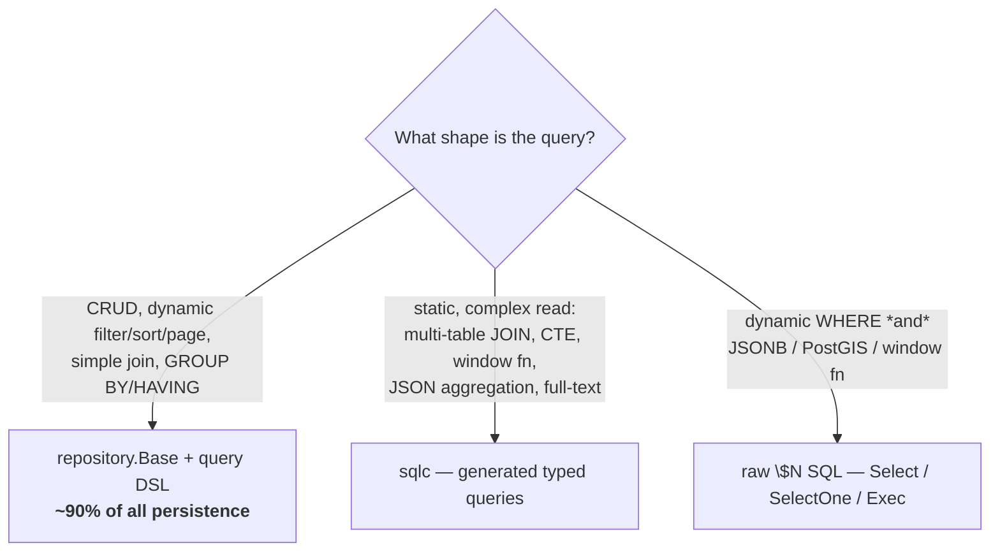

# SQLC vs the DSL — Choosing a Persistence Approach

## Learning objectives

- State the platform's **three-legged persistence standard** and place any query on it.
- Apply concrete **decision criteria** to pick `repository.Base` + DSL, sqlc, or raw SQL — without guessing.
- Scaffold, generate, and wire a sqlc query so it participates in transaction propagation.
- Reason about the **performance** trade-offs (they are smaller than people assume — and not where you think).
- Recognize the anti-patterns a reviewer will flag: sqlc for CRUD, raw SQL for a single-table lookup, an ORM for anything.

## Prerequisites

- [Database Patterns](database-patterns) — the DSL, `repository.Base`, the raw escape hatches.

## Time estimate

**3 hours**

## Concepts

### The three-legged standard

There is **no ORM** on this platform. Persistence stands on exactly three legs, and every query belongs to precisely one of them (FRAMEWORK.md §1, `sqlcx` package doc):



Read that as a priority order, not a menu: **default to leg 1**, escalate only when the shape genuinely forces it.

| Leg | Package | Owns | Compile-time typed? | Dynamic WHERE? |
|---|---|---|---|---|
| **1. DSL** | `repository.Base` + `query` | CRUD, filtering, paging, bulk, locking, simple joins, aggregation | rows yes (generics), SQL no | **yes** |
| **2. sqlc** | generated pkg + `sqlcx` | static complex SQL — JOINs, CTEs, windows, JSON, FTS | **yes (both)** | no |
| **3. raw** | `Base.Select`/`SelectOne`/`Exec` | the last-resort intersection: dynamic *and* exotic | rows via row structs, SQL no | yes |

### The decision criteria — three questions, in order

Ask them top to bottom; the first "yes" that fits wins.

1. **Can `repository.Base` + the DSL express it?** CRUD, `Exists`/`Count`, filtered/sorted/paged lists, `Join`+`Select`, `GroupBy`/`Having`, bulk, `UpdateVersioned`. If yes → **use the DSL.** This is ~90% of queries and is the *only* leg that does dynamic WHERE. Reaching past it for anything it can say is a review finding.
2. **Is it a *static* complex read the DSL can't say?** A multi-table JOIN you'd rather see as real SQL, a CTE, a window function used *for filtering* (top-N-per-group), JSON aggregation, recursive queries, full-text search — and the WHERE shape is *fixed* (not "maybe filter by status, maybe not"). If yes → **use sqlc.**
3. **Is it both dynamic *and* beyond the column builder?** A WHERE clause assembled at runtime that also needs a JSONB predicate, a PostGIS function, or a window expression — the one place sqlc can't reach (no dynamic WHERE) and the builder can't reach (not column-oriented). If yes → **raw `$N` SQL** through the escape hatches, following the four guardrails from [Database Patterns](database-patterns).

The load-bearing distinction between legs 2 and 3 is **static vs dynamic**. sqlc's superpower is compile-time verification against a real schema; that power *requires* the SQL be fixed text. The moment the WHERE is assembled at runtime, sqlc is out — not because it's complex, but because it's dynamic.

### Leg 1 — the DSL (the default, recap)

Covered in full on the previous page. The one-line reminder of why it's the default: it is the **only** leg that expresses a WHERE clause built at runtime from user filters, and that describes the overwhelming majority of endpoints (list this, filter by that, page the rest). Example, for contrast with what follows:

```go
// dynamic — the set of predicates depends on which query params arrived:
page, err := r.Query(ctx).
	Where(f.conditions(principal)...).  // 0..n predicates, decided at runtime
	OrderByDesc("updated_at").
	Limit(limit).Offset(offset).
	Page(ctx)
```

No static SQL string could express `f.conditions(...)` — that's the DSL's whole reason to exist, and why sqlc can never replace it.

### Leg 2 — sqlc, for the static complex read

sqlc generates a per-service Go package from checked-in `.sql` files, giving **compile-time-typed rows with zero reflection and zero hand-written `Scan` code** — and, crucially, nothing is hidden: you `go-to-definition` into the generated function like any other code. What sqlc *cannot* do is a dynamic WHERE; that stays on the DSL.

**Scaffold** the canonical layout (no local install needed):

```bash
go run github.com/datakaveri/dx-common-go/cmd/dx sqlc init
# → sqlc.yaml
# → db/sqlc/schema.sql          (paste your reference schema snapshot here)
# → db/sqlc/queries/            (your annotated .sql lives here)
```

**Write** the query — a genuine case the `Finder` can't do: "the 3 most recent notes per user" (top-N-per-group needs a window function *filtered on*, which requires a CTE to wrap it):

```sql
-- db/sqlc/queries/notes.sql
-- name: RecentNotesPerUser :many
WITH ranked AS (
    SELECT id, user_id, title, created_at,
           ROW_NUMBER() OVER (PARTITION BY user_id ORDER BY created_at DESC) AS rn
    FROM notes
    WHERE deleted_at IS NULL
)
SELECT id, user_id, title, created_at
FROM ranked
WHERE rn <= $1
ORDER BY user_id, created_at DESC;
```

**Generate** — reproducible, pinned version:

```bash
go run github.com/sqlc-dev/sqlc/cmd/sqlc@v1.27.0 generate
```

**Wire** it through `sqlcx.DB` so a generated query is **transaction-propagation-aware** exactly like a `Base[R]` call — it joins the same ambient `InTransaction` ([Transactions](transactions)):

```go
import (
	"github.com/datakaveri/dx-common-go/database/postgres/sqlcx"
	sqlcgen "yourmodule/internal/repository/postgres/sqlcgen"
)

// sqlcx.DB(ctx, pool) returns the ambient tx if ctx carries one, else the pool.
q := sqlcgen.New(sqlcx.DB(ctx, r.Pool()))
recent, err := q.RecentNotesPerUser(ctx, 3)
```

That one line — `sqlcx.DB(ctx, pool)` — is the whole reason `sqlcx` exists. sqlc generates a `DBTX` interface but no tx-aware provider; `sqlcx.DB` is it, and it makes generated queries first-class transaction citizens instead of a second, disconnected data path.

**Combine** sqlc *alongside* the generic CRUD surface when a repository needs both — `repository.NewWithSQL[R, Q]` attaches the generated `Queries` as a typed accessor rather than a second object floating loose:

```go
type NoteRepo struct {
	*repository.BaseWithSQL[noteRow, *sqlcgen.Queries]
}

func NewNoteRepo(pool *pgxpool.Pool) *NoteRepo {
	return &NoteRepo{BaseWithSQL: repository.NewWithSQL[noteRow, *sqlcgen.Queries](
		pool, sqlcgen.New(sqlcx.DB(context.Background(), pool)),
		repository.WithTable[noteRow]("notes"))}
}

// generic CRUD is still promoted: r.FindByID(...), r.Query(ctx)...
// and the generated queries hang off r.SQL():
func (r *NoteRepo) Recent(ctx context.Context, n int32) ([]sqlcgen.RecentNotesPerUserRow, error) {
	return r.SQL().RecentNotesPerUser(ctx, n)
}
```

**Good sqlc candidates** (from `sqlcx` doc): dx-community-layer-go (aggregates / JSON), dx-dataplane-ogc-go (PostGIS reporting). Note the honest status: *no service uses sqlc yet* — dx-acl-go's one static join moved onto the DSL's `Finder.Join`/`Select`. That is itself the lesson: escalate to sqlc only when the DSL genuinely can't, not on the first sight of a JOIN.

### Leg 3 — raw SQL, the sanctioned last resort

For the intersection sqlc can't reach (dynamic) and the builder can't reach (JSONB/PostGIS/window), use the `Base` escape hatches — still parameterized, still through the shared error translator:

```go
// dynamic WHERE assembled at runtime, plus a JSONB containment predicate:
rows, err := r.Select(ctx, `
    SELECT id, attributes
    FROM datasets
    WHERE attributes @> $1
      AND `+whereClause /* code-authored, allowlisted */ +`
    ORDER BY created_at DESC`, jsonbFilter, args...)
```

The four guardrails (unchanged from [Database Patterns](database-patterns)): `$N` placeholders for values; **identifiers only from a code-side allowlist**; declarative row structs (`pgx.RowToStructByPos`), never hand-written `Scan`; and a comment stating *why* it's raw. Raw SQL is legitimate — but it is the leg you justify in review, not the one you reach for by habit.

### Performance considerations

The instinct is "generated/raw SQL is faster than a builder." On this stack that instinct is **mostly wrong**, and where it's right, it's for reasons that rarely matter:

- **Execution is identical.** All three legs run through the *same* pgx pool and speak the *same* wire protocol with the *same* `$N` bound parameters. Postgres sees the same SQL and plans it the same way. There is no interpreter, no N+1-by-construction, no reflection in the hot path (row mapping is generics/codegen, not `reflect`). The database does the work; the leg you chose is just how the SQL got authored.
- **The DSL builds SQL as strings once per call** — negligible against a network round-trip and query planning. It is not an ORM materializing object graphs; it emits one statement.
- **sqlc's win is *correctness and clarity*, not speed** — the SQL is verified against your schema at build time and reads as real SQL. A hand-tuned sqlc query *can* out-plan a mechanically-built one (better JOIN order, a partial-index-friendly predicate, a covering `SELECT`), but that's you writing better SQL, not sqlc being a faster runtime.
- **Where performance actually lives:** indexes, `EXPLAIN (ANALYZE, BUFFERS)`, `FindPage`'s two-query count vs keyset pagination, `CopyFrom` vs row-by-row inserts, and *not* issuing a query in a loop. Choose the leg for **expressiveness and safety**; reach for the profiler for speed. See [Memory & Performance](../module-2-intermediate/memory-performance) and [Benchmarking](../module-2-intermediate/benchmarking-profiling).

Rule of thumb: pick the leg that makes the query **clearest and safest to read in review**. Performance differences between legs are dominated by the query plan, which you control with SQL and indexes regardless of leg.

### Anti-patterns a reviewer will flag

- **sqlc for plain CRUD / `Exists` / `Count` / paging.** That is `BaseDAO`'s job; a generated `GetNoteByID` is pure friction. (`sqlcx` doc says this outright: "Never use sqlc for plain CRUD.")
- **sqlc for a dynamic WHERE.** It literally can't — you'd end up string-concatenating around the generated code, which is worse than either leg alone. Dynamic → DSL.
- **Raw SQL for a single-table lookup.** The builder-vs-raw rule: if the DSL can say it, it must.
- **Reaching for sqlc on the first JOIN.** `Finder.Join`+`Select` handles simple joins; escalate only for CTEs/windows/JSON/FTS. (This is exactly the call dx-acl-go re-made — off sqlc, onto the DSL.)
- **Any ORM.** Not a leg. Deliberately not built (FRAMEWORK.md §7).

:::info[Platform connection]
The standard is normative: `dx-common-go/FRAMEWORK.md` §1 (three-legged persistence) and the `database/postgres/sqlcx` package doc are the source of truth — read both; they're short. Scaffolding lives in `cmd/dx` (`dx sqlc init`). The `NewWithSQL`/`BaseWithSQL` bridge is in `database/postgres/repository`. When you believe a query needs leg 2 or 3, the PR should say *which* DSL capability fell short — "top-N-per-group needs a CTE" — not just "complex query."
:::

## Exercises

1. **Classify ten queries.** For each of: get-by-id; list-with-filters; count-pending; top-3-notes-per-user; datasets whose JSONB `attributes @> {...}` with a runtime status filter; monthly revenue report (`GROUP BY date_trunc`); recursive org-hierarchy walk; bulk insert 50k rows; full-text search over titles; "does a pending request exist for (item, consumer)" — name the leg and one sentence of justification.
2. **Write one genuine sqlc query** the DSL can't do (top-N-per-group or a CTE report). Scaffold with `dx sqlc init`, generate, and call it through `sqlcx.DB` inside an `InTransaction` — prove (with a log line in `sqlcx.DB`'s two branches) that it joined the ambient transaction.
3. **Refuse sqlc correctly.** Take a query someone wrote as sqlc that is actually plain CRUD + a simple join, and rewrite it on `Finder.Join`/`Select`. Delete the `.sql` file and the generated code. Note how many lines vanished.
4. **Prove the perf claim.** Write the same filtered list two ways — DSL vs a hand-written raw `Select` — run both under `EXPLAIN ANALYZE` and a quick benchmark. Confirm the plans (and timings) match, and that the difference is the index, not the leg.

## Check yourself

- What single property of a query decides sqlc vs raw SQL, given both are "complex"?
- Why can sqlc never replace the DSL for list endpoints?
- What does `sqlcx.DB(ctx, pool)` do, and why does a generated query need it?
- Name three queries that must *not* be sqlc.
- "Raw SQL is faster than the builder" — when is that true, and why is it usually irrelevant here?

## References

- [SQLC docs](https://docs.sqlc.dev/) · [PostgreSQL: Window Functions](https://www.postgresql.org/docs/current/tutorial-window.html) · [WITH / CTEs](https://www.postgresql.org/docs/current/queries-with.html)
- Platform: `dx-common-go/FRAMEWORK.md` §1; `database/postgres/sqlcx` (package doc); `database/postgres/repository` (`NewWithSQL`); `cmd/dx` (`sqlc init`); prev/next: [Database Patterns](database-patterns) → [Schema Migrations](schema-migrations)
