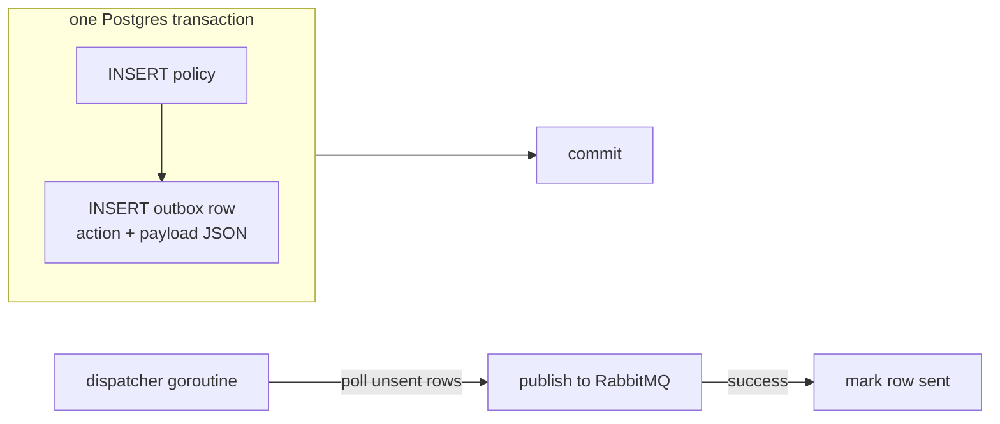

# Transactions

## Learning objectives

- Run multi-statement units atomically with pgx transactions and the deferred-rollback idiom.
- Use the platform helpers: `postgres.WithTransaction` and `BaseDAO.WithTx`.
- Know isolation levels at working depth and Postgres's default.
- Understand the transactional outbox — the pattern that makes "write DB + publish event" safe.

## Prerequisites

- [Database Patterns](database-patterns)

## Time estimate

**4 hours**

## Concepts

### The idiom: defer rollback, then commit

```go
tx, err := pool.Begin(ctx)
if err != nil {
	return fmt.Errorf("begin: %w", err)
}
defer tx.Rollback(ctx) // no-op after a successful Commit — that's the trick

if _, err := tx.Exec(ctx, insertPolicy, ...); err != nil {
	return fmt.Errorf("insert policy: %w", err) // deferred rollback fires
}
if _, err := tx.Exec(ctx, insertAudit, ...); err != nil {
	return fmt.Errorf("insert audit: %w", err) // same
}
return tx.Commit(ctx) // after this, the deferred Rollback does nothing
```

`defer tx.Rollback(ctx)` immediately after `Begin` covers **every** exit path — early returns, wrapped errors, even panics — with zero bookkeeping. Rolling back a committed transaction is a harmless no-op. This exact shape is required by the platform style rules; reviewers look for the defer on the line after `Begin`.

### The platform helpers

The idiom, packaged (`dx-common-go/database/postgres`):

```go
err := postgres.WithTransaction(ctx, pool, func(tx pgx.Tx) error {
	if err := insertPolicies(ctx, tx, policies); err != nil {
		return err // → rollback
	}
	return insertOutboxRows(ctx, tx, events) // nil → commit
})
```

And for repositories built on the generic DAO, `WithTx` rebinds a DAO to a transaction without duplicating any query code:

```go
txDao := dao.WithTx(tx)          // same BaseDAO[T], now executing inside tx
_, err := txDao.Insert(ctx, &p)
```

Design point worth absorbing: the transaction is owned by the **service layer** (which knows the unit of work) and passed *into* repository calls — repositories don't begin transactions themselves, or units of work couldn't compose.

### Isolation, briefly

Postgres defaults to **Read Committed**: each statement sees data committed before it started. That's right for nearly all DX operations. Know the ladder — Read Committed → Repeatable Read → Serializable — and the trade (stronger isolation ⇒ more retries/aborts under contention). Reach higher only with a concrete anomaly in hand (e.g. a read-modify-write race on account balances), and expect to handle serialization failures by retrying. For counters and stock-like updates, a single atomic `UPDATE ... SET n = n - 1 WHERE n > 0` usually beats raising isolation.

### The transactional outbox

Now the pattern that ties Modules 3's database and messaging halves together. The problem: a policy is created **and** an event must reach RabbitMQ. Two systems, no shared transaction:

- Publish after commit → crash between them loses the event (OpenFGA never learns; access silently broken).
- Publish before commit → rollback leaves a phantom event (access granted for a policy that doesn't exist).

The outbox solution — make the event part of the database transaction:



The policy and its event now commit or vanish **together**. A separate dispatcher (a supervised background goroutine — your [Concurrency](../module-2-intermediate/concurrency) worker shape) drains unsent rows and publishes. Delivery becomes **at-least-once**: if the dispatcher crashes after publishing but before marking sent, the event goes out twice — which is why consumers must be idempotent, the thread picked up in [Event-Driven Architecture](event-driven-rabbitmq) and [Distributed Systems](distributed-systems).

:::info[Platform connection]
`dx-acl-go` is the reference implementation: `InsertPoliciesWithOutbox` in `internal/repository/postgres/policy_repo.go` writes policies and outbox rows in one transaction, and `internal/service/outbox_dispatcher.go` is the polling dispatcher that publishes `policy.*` events to the `authz` exchange. GO-SERVICE-STANDARDS makes the rule general: **state-changing events go through a transactional outbox** — publish-after-commit is a review finding, not a style preference.
:::

## Exercises

1. Give `dx-scratch-go` a two-table operation (create note + append note_history) inside `WithTransaction`-style code you write yourself. Force a failure on the second insert and prove the first rolled back.
2. Demonstrate lost-update: two goroutines read-increment-write the same counter under Read Committed (use `pgx` directly, add a sleep between read and write). Fix it twice — atomic UPDATE, then `SELECT ... FOR UPDATE` — and explain when you'd pick each.
3. Build a mini outbox: `events` table written in the note-create transaction, plus a dispatcher goroutine (interval poll, context-cancelled — your Module 2 shape) that "publishes" by printing and marks rows sent. Kill the process at each dangerous moment and account for what happens on restart.
4. Read `dx-acl-go`'s outbox code and answer: what column marks a row sent? What happens to a row whose publish fails — and how often is it retried?

## Check yourself

- Why is `defer tx.Rollback(ctx)` safe after a successful commit?
- Why does the service layer, not the repository, own transaction boundaries?
- What exactly can go wrong with publish-after-commit, and how does the outbox close it?
- What delivery guarantee does the outbox produce, and what does it demand of consumers?

## References

- [pgx transactions](https://pkg.go.dev/github.com/jackc/pgx/v5#hdr-Transactions)
- [PostgreSQL: Transaction Isolation](https://www.postgresql.org/docs/current/transaction-iso.html)
- [microservices.io: Transactional outbox](https://microservices.io/patterns/data/transactional-outbox.html)
- Platform: `dx-common-go/database/postgres/transaction.go`; `dx-acl-go` outbox implementation
