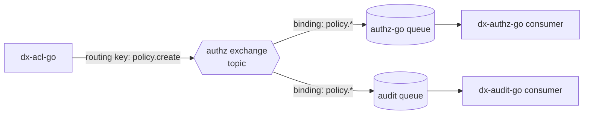

# Event-Driven Architecture & RabbitMQ

## Learning objectives

- Model messaging with AMQP primitives: exchanges, queues, bindings, routing keys.
- Publish reliably (confirms, persistent messages) and via the outbox from the previous page.
- Declare production-grade topology: durable + DLX + DLQ + TTL.
- Write consumers that are idempotent, retry within bounds, and shut down gracefully.

## Prerequisites

- [Transactions](transactions) (the outbox), [Concurrency](../module-2-intermediate/concurrency)

## Time estimate

**5 hours**

## Concepts

### Why events at all

Synchronous calls couple availability: if `dx-acl-go` called `dx-authz-go`'s API to sync every policy, authz downtime would block policy creation. Instead the platform's services communicate state changes through **RabbitMQ**: the producer records what happened; consumers catch up when they can. The cost is eventual consistency — a topic [Distributed Systems](distributed-systems) treats properly.

### AMQP in five nouns

Producers never send to queues. They publish to an **exchange** with a **routing key**; **bindings** decide which **queues** get a copy; **consumers** drain queues.



A **topic** exchange routes on key patterns (`policy.*` matches `policy.create`, `policy.delete`) — one publish, any number of interested queues, producer none the wiser. That's the decoupling: adding a consumer is a new queue + binding, zero producer changes.

### Publishing reliably

The naive `ch.Publish(...)` can silently drop messages (connection lost, broker overloaded). Production publishing means:

- **Publisher confirms** — the broker acks each publish; unconfirmed → retry.
- **Persistent messages** into **durable** topology — survives broker restart.
- **Auto-reconnect** — AMQP connections die; the client must rebuild channel + topology and resume.
- **Message identity** — set `message_id` (the entity/request ID) so consumers can deduplicate; version payloads (`"version": 1`) so schemas can evolve.

All of that is why the platform wraps amqp091-go in `dx-common-go`'s client (reconnect loop with backoff) and `ReliablePublisher` (confirms + retries) — and why the standards say **publish through ReliablePublisher only**, with state-changing events additionally going through the [transactional outbox](transactions).

### Topology that survives bad days

Every platform queue is declared with four properties — memorize the quartet: **durable** (survives restarts), **DLX** (a dead-letter exchange target), **DLQ** (the queue collecting dead letters), **TTL** (messages/retries don't accumulate forever).

The DLQ is the crucial one. A malformed or persistently failing message ("poison pill") must not requeue forever — redelivered, failed, redelivered, burning the consumer alive. Bounded handling:

```
attempt → fail → nack (no requeue) → DLX routes to DLQ → human inspects later
```

The platform's own review found queues missing DLQs (the audit pipeline, notably) and classed it a **critical** finding — a poison message in a DLQ-less queue can stall an entire consumer.

### Consumers: idempotent, bounded, graceful

```go
deliveries, err := ch.Consume(queue, "", false /* manual ack */, ...)
for {
	select {
	case d, ok := <-deliveries:
		if !ok {
			return nil // channel closed (connection loss / shutdown)
		}
		if err := handle(ctx, d.Body); err != nil {
			d.Nack(false, false) // no requeue → DLX → DLQ
			continue
		}
		d.Ack(false)
	case <-ctx.Done():
		return ctx.Err() // graceful stop, in-flight message finished
	}
}
```

Three properties, all mandatory per the standards:

1. **Idempotent** — the outbox gives at-least-once delivery, so `policy.create` *will* occasionally arrive twice. Handlers must converge: check-then-insert, upserts, or dedup on `message_id`. "Insert blindly" duplicates data on redelivery.
2. **Bounded retry** — transient failures may requeue/retry a few times; then DLQ. Never infinite.
3. **Graceful shutdown** — finish the in-flight message, ack/nack it, then exit on context cancellation. Killing mid-handle causes redelivery (fine — you're idempotent) but never data loss.

Malformed JSON is the special case: it will *never* succeed, so ack-and-drop (with an error log) or DLQ immediately — do not retry the unparseable.

:::info[Platform connection]
The `authz` exchange is the architecture's spine: `dx-acl-go` publishes `policy.create`/`policy.delete` (outbox → ReliablePublisher), `dx-user-go` publishes `org.member.*`, and `dx-authz-go` consumes both to project OpenFGA tuples — that's how a policy becomes an authorization decision within seconds. Read `dx-authz-go`'s consumer, plus `dx-audit-go/internal/consumer/consumer.go` (persist-to-Postgres, ack/nack, poison-pill drop) and `dx-notification-go`'s (consume → resolve email → SMTP). All three are short, and between them they contain every pattern on this page.
:::

## Exercises

*(Local RabbitMQ at `:5672`, UI at `:15672`.)*

1. Declare the full quartet by hand — durable queue + DLX + DLQ + TTL — with amqp091-go, publish persistent messages, restart the broker container, and verify survival.
2. Wire `dx-scratch-go`'s outbox dispatcher (from [Transactions](transactions)) to really publish `note.created` to a topic exchange. Watch messages in the management UI.
3. Write a consumer with the select loop above that inserts into a `note_search` table idempotently (upsert on `message_id`). Deliver the same message twice; prove one row.
4. Poison it: publish garbage JSON. First let it requeue (nack with requeue=true) and watch the loop spin; then fix to nack-without-requeue and find the message sitting in your DLQ.
5. In the RabbitMQ UI, map the real `authz` exchange: bindings, queues, and — after a `make dev-demo` run — message rates.

## Check yourself

- Why do producers publish to exchanges rather than queues, and what does that decouple?
- Recite the queue quartet and the failure each part prevents.
- Where does at-least-once delivery come from in this platform, and what does it force on consumers?
- Malformed message vs failing message — why do they deserve different treatment?

## References

- [RabbitMQ tutorials](https://www.rabbitmq.com/tutorials) (1, 3, 5 minimum) · [amqp091-go](https://pkg.go.dev/github.com/rabbitmq/amqp091-go)
- [RabbitMQ: Dead Letter Exchanges](https://www.rabbitmq.com/docs/dlx) · [Publisher Confirms](https://www.rabbitmq.com/docs/confirms)
- Platform: `dx-common-go/messaging/rabbitmq`; consumers in `dx-audit-go`, `dx-notification-go`, `dx-authz-go`
