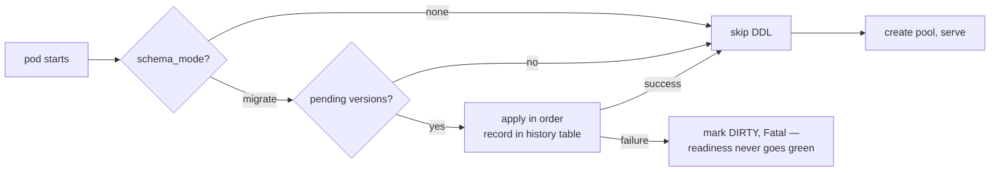

# Schema Migrations

## Learning objectives

- Explain why schema changes must be versioned files, not hand-run SQL or app-issued DDL.
- Write a migration pair (`.up.sql` / `.down.sql`) and wire it into a service.
- Run migrations locally, understand the `schema_mode` gate, and recover a **dirty** database.
- State the platform's ownership rule: what Flyway owns, what your Go service owns.
- Argue the roll-forward position: why production "rollback" is another migration.

## Prerequisites

- [Database Patterns](database-patterns)

## Time estimate

**3 hours**

## Concepts

### Why migrations at all?

A service's code is versioned, reviewed, and reproducible from any commit. Its **schema** must be too — otherwise "works on my machine" becomes "works on my database." Concretely, migrations buy you:

- **Reproducibility** — a fresh environment (new dev laptop, CI job, new deployment) reaches the exact schema the code expects, mechanically.
- **Review** — DDL goes through the same PR review as code. `ALTER TABLE` in a migration file gets eyes; `ALTER TABLE` typed into psql at 6pm does not.
- **Ordering** — change 12 depends on change 11. Versioned files encode that; tribal knowledge doesn't.
- **Auditability** — the database records which versions have been applied, so drift is detectable instead of mysterious.

The alternative the platform *used* to have — each service running idempotent `CREATE TABLE IF NOT EXISTS` at boot ("EnsureSchema") — could only ever create; it couldn't alter, migrate data, or tell you what version a database was at. It has been retired fleet-wide.

### The framework: golang-migrate, embedded

The platform standardized on **[golang-migrate](https://github.com/golang-migrate/migrate)** (evaluated against goose; see `claude-docs/DATABASE.md` §7). Migrations are plain SQL files embedded into the binary and run **at boot** by a shared runner:

```
dx-acl-go/
  db/
    migrations.go              ← //go:embed migrations/*.sql
    migrations/
      0001_baseline.up.sql     ← paired, zero-padded, sequential
      0001_baseline.down.sql
```

```go
// db/migrations.go
package db

import "embed"

//go:embed migrations/*.sql
var Migrations embed.FS
```

```go
// cmd/server/main.go — before the pool is created
if err := dxmigrate.Run(dxmigrate.Config{
    Mode:      cfg.SchemaMode,            // "migrate" | "none"
    DSN:       cfg.Postgres.DSN,
    TableName: "schema_migrations_acl",   // only on a SHARED database
}, acldb.Migrations, "migrations", logger); err != nil {
    logger.Fatal("apply schema migrations", zap.Error(err))
}
```

The runner is `dx-common-go/database/postgres/migrate`. Three things to notice:

1. **`Mode` gate** — `migrate` (default) applies pending migrations; `none` runs no DDL at all (for environments where a DBA or init job owns schema application).
2. **`TableName`** — golang-migrate records applied versions in a history table. On a database a service owns outright, the default (`schema_migrations`) is fine. On the **shared** legacy `iudx_db`, each service uses its own table (`schema_migrations_acl`, `schema_migrations_user`, …) so services don't clobber each other's history.
3. **Embedded** — the binary carries its schema. No separate migration artifact to version-skew against the code.

### The ownership rule (read this twice)

The platform runs Go services against the **legacy databases** during migration, and the Java stack's **Flyway owns those tables** ([Architecture Deep Dive](../module-4-platform/architecture-deep-dive)). So:

| Table kind | Who migrates it | Your Go migration may… |
|---|---|---|
| Legacy tables (`policy`, `user_table`, `request`, …) | **Flyway (Java)** | **never touch them** — no CREATE, no ALTER |
| Net-new tables your service added (`policy_outbox`, …) | **your Go migrations** | own them fully |
| Tables on a database your service owns outright (ogc, community-layer, marketplace) | **your Go migrations** | own the whole schema, extensions included |

This is why `dx-acl-go`'s baseline creates only `policy_outbox` and `request`-adjacent enums — not `policy`. And why audit columns (`created_by` …) are **deferred** on legacy tables: we can't ALTER what Flyway owns. Violating this boundary is the fastest way to break the parallel-run guarantee.

### Creating a migration — when and how

**When:** any change to a table your service owns — a new table, a column, an index, a constraint, a backfill. If it changes the schema, it is a migration file, never an `ALTER` typed into psql and never app-issued DDL. **When not:** never against a Flyway-owned legacy table (see the ownership rule above).

**How:** scaffold the paired files with the platform CLI so numbering and naming are correct by construction —

```bash
go run github.com/datakaveri/dx-common-go/cmd/dx new migration add_outbox_attempts
# → db/migrations/0002_add_outbox_attempts.up.sql
# → db/migrations/0002_add_outbox_attempts.down.sql   (both created, empty)
```

Naming: `NNNN_short_title.up.sql` + `NNNN_short_title.down.sql`, zero-padded, strictly sequential — **not timestamps**, so ordering is reviewable in a diff:

```sql
-- db/migrations/0002_outbox_attempts.up.sql
ALTER TABLE policy_outbox ADD COLUMN IF NOT EXISTS attempts INT NOT NULL DEFAULT 0;

-- db/migrations/0002_outbox_attempts.down.sql
-- destructive: drops retry bookkeeping. reviewed-by: platform
ALTER TABLE policy_outbox DROP COLUMN IF EXISTS attempts;
```

Rules the platform enforces in review:

- **Baselines are idempotent** (`IF NOT EXISTS`) so databases provisioned before the framework adopt the history cleanly on first run. Later migrations don't need to be — by then the history table guarantees exactly-once application.
- **One concern per migration.** A migration that creates a table *and* backfills *and* adds an index is three migrations.
- **Never edit an applied migration.** Once `0002` has run anywhere beyond your laptop, it's immutable — fix mistakes with `0003`.
- **Expand → migrate → contract** for zero-downtime changes: add the new column (deploy N), dual-write/backfill (N), switch reads (N+1), drop the old column (N+2). Never rename in place while old code is running.
- **Down files exist for dev/CI**, and destructive downs carry a `-- destructive:` marker.

### Running locally

Boot the service — migrations run first, before the pool:

```
make dev-up          # each Go service applies its own pending migrations at boot
```

Fresh scratch database? Same thing: start the service against it and the baseline provisions everything (ogc even runs `CREATE EXTENSION postgis`). To *prevent* DDL (e.g., pointing at a production snapshot): `SCHEMA_MODE=none`.

### Dirty state — the failure you will eventually meet

If a migration fails halfway, golang-migrate marks the database **dirty** and refuses to run anything until a human decides what happened. The platform runner logs loudly:

```
schema migrations FAILED — database may be DIRTY
  failed_version=3
  recovery: verify what 0003 actually applied, fix the database by hand if
  needed, then force the version back: migrate ... force 2  — and redeploy.
```

This is deliberate: a half-applied migration is precisely the situation where blind retries destroy data. Inspect, repair, `force` the version, redeploy.

### Managing schema versions across services

Multiple Go services share the interim `iudx_db`, so version tracking has to stay collision-free **and** independently checkable per service:

- **One history table per service.** Each `Run` call passes its own `TableName` (`schema_migrations_acl`, `schema_migrations_user`, …) — golang-migrate's `x-migrations-table` convention expressed through `Config.TableName`. Service A at version 5 and service B at version 12 coexist in one database without either seeing the other's history.
- **The binary carries its schema.** Migrations are embedded (`embed.FS`), so "which versions exist" is a property of the deployed image, not a separate artifact that can version-skew against the code.
- **Detect drift with `Status` before serving.** `dxmigrate.Status(cfg, fsys, dir)` returns `(version, dirty, err)` without applying anything — use it for a boot-time guard that refuses to start if the database is *ahead* of this binary (a rollback that left newer migrations applied), which a plain `Run` wouldn't catch. Pair it with the readiness gate below.
- **Expand → migrate → contract keeps versions rolling-compatible.** Because a rolling deploy runs the old and new binaries against the *same* database for a window, every migration must leave the previous binary able to run — which is the whole reason additive-first ordering is normative, not just tidy.

### Rollback strategies — roll forward, expand/contract, and the dev-only down

Production "rollback" is not `migrate down`. There are three tools, for three situations:

1. **Roll forward (the default).** If `0007` shipped something wrong, write `0008` that corrects it. Down migrations are the least-tested SQL in any codebase — running them for the first time *during an incident* is how incidents get worse; data written since the deploy often can't be un-written (a dropped column takes its data with it); and roll-forward keeps one linear history that matches what actually happened.
2. **Expand → migrate → contract *is* your safe rollback for schema shape.** Because the expand step is additive and the old binary still works against the expanded schema, you can roll the *application* back to the previous image at any point before the contract migration ships — no schema change needed. This is why you never rename/retype a column in place: doing so removes the ability to roll the binary back. The schema's backward-compatibility window is the rollback plan.
3. **Down migrations — dev and CI only.** Downs still exist; they make local iteration and the CI up→down→up reversibility check cheap. They are a development tool, not an operational one. Never wire an automatic down into a deploy.

### CI/CD

The deployment pattern (GitOps, [CI/CD](cicd)): migrations run at pod boot, before readiness. A failed migration fails readiness → the rollout halts with the old version still serving. The CI job worth having (tracked on the platform roadmap): from-zero `up` on a scratch Postgres, plus newest `down`/`up` cycle, so a broken migration fails the PR instead of the deploy.



:::info[Platform connection]
Worked examples, in increasing complexity: **dx-marketplace-go** (own DB, default history table), **dx-dataplane-ogc-go** (own DB + PostGIS extension in the baseline), **dx-acl-go** (shared `iudx_db` → service-scoped `schema_migrations_acl`, baseline covers only net-new tables), **dx-community-layer-go** (two module databases, one embedded FS each — and a live example of adopting the framework over a previously hand-applied schema). The runner: `dx-common-go/database/postgres/migrate/migrate.go` — short, read it.
:::

## Exercises

1. Give `dx-scratch-go` a versioned baseline: move your exercise DDL into `db/migrations/0001_baseline.{up,down}.sql`, embed it, call `dxmigrate.Run` before pool creation. Boot against a fresh database and inspect the `schema_migrations` table.
2. Add `0002`: a new column with a default. Boot again — verify only `0002` runs (check the history table version).
3. Break it on purpose: write `0003` with a syntax error mid-file, boot, and observe the dirty-state log. Recover with `migrate ... force 2` (CLI or by fixing the history row) and re-run.
4. Zero-downtime rename: plan (on paper) the expand→migrate→contract sequence to rename `title` to `subject` while old pods keep serving. Which migration ships with which deploy?
5. Read `dx-acl-go/db/migrations/0001_baseline.up.sql` and answer: why does it create `policy_outbox` but not `policy`? What would happen if it tried?

## Check yourself

- Why does each service on the shared `iudx_db` need its own history table?
- What makes a baseline safe to run against a database that already has the tables?
- A migration fails in production at version 5. What exactly do you do — and what do you *not* do?
- Why is "just run the down migration" a trap during an incident?
- When is `schema_mode: none` the right setting?

## References

- [golang-migrate](https://github.com/golang-migrate/migrate) · [migrate CLI](https://github.com/golang-migrate/migrate/tree/master/cmd/migrate)
- [Evolutionary Database Design (Fowler)](https://martinfowler.com/articles/evodb.html)
- Platform: `dx-common-go/database/postgres/migrate`; `claude-docs/DATABASE.md` §7; `claude-docs/MIGRATION.md` §0 (the governing principle)
