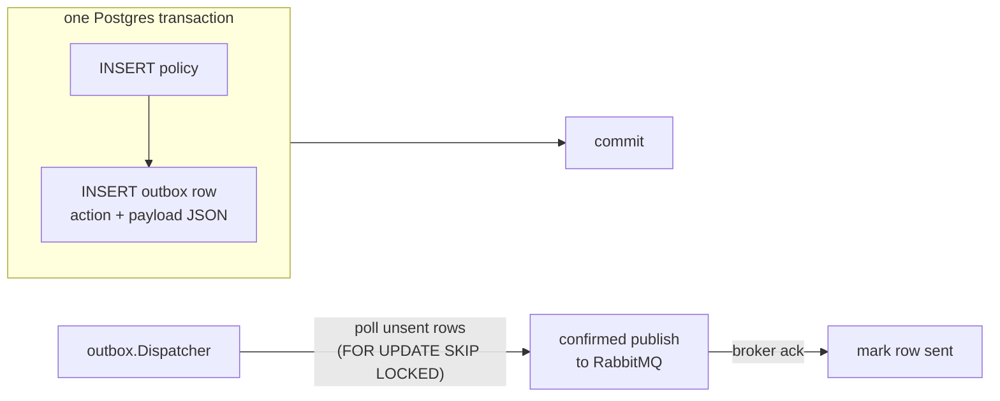

# Transactions

## Learning objectives

- Run multi-statement units atomically with pgx transactions and the deferred-rollback idiom.
- Use **`postgres.InTransaction`** — context-propagated transactions that repositories join automatically.
- Retry serialization failures with `InRetryableTransaction`, and know when that's safe.
- Know isolation levels at working depth and Postgres's default.
- Understand the transactional outbox — the pattern that makes "write DB + publish event" safe.

## Prerequisites

- [Database Patterns](database-patterns)

## Time estimate

**4 hours**

## Concepts

### The idiom underneath: defer rollback, then commit

```go
tx, err := pool.Begin(ctx)
if err != nil {
	return fmt.Errorf("begin: %w", err)
}
defer tx.Rollback(ctx) // no-op after a successful Commit — that's the trick

if _, err := tx.Exec(ctx, insertPolicy, ...); err != nil {
	return fmt.Errorf("insert policy: %w", err) // deferred rollback fires
}
return tx.Commit(ctx)
```

`defer tx.Rollback(ctx)` immediately after `Begin` covers **every** exit path — early returns, wrapped errors, even panics. Rolling back a committed transaction is a harmless no-op. You'll rarely write this by hand on the platform, but everything below is this idiom packaged — and you must be able to see through the package.

### The platform API: `InTransaction` and context propagation

The problem the old style had: to make two repository calls atomic, the service had to *thread a `pgx.Tx` through every signature*. The platform's answer (`dx-common-go/database/postgres`) is **context propagation**:

```go
// Service layer — owns the unit of work. ONE wrapper, zero tx plumbing:
err := postgres.InTransaction(ctx, pool, func(ctx context.Context, _ pgx.Tx) error {
	if _, err := s.policySvc.Create(ctx, reqs, caller); err != nil {
		return err                          // → rollback (both writes vanish)
	}
	_, err := s.repo.UpdateStatus(ctx, id, GRANTED, expiry, constraints)
	return err                              // nil → commit (both land together)
})
```

How the repositories join without being told: `InTransaction` stashes the transaction in the context, and every `repository.Base` method checks for it —

```go
// inside repository.Base — the ONLY place this rule lives:
func (b *Base[R]) DAO(ctx context.Context) *dao.BaseDAO[R] {
	if tx, ok := postgres.TxFromContext(ctx); ok {
		return b.dao.WithTx(tx)   // ambient transaction → join it
	}
	return b.dao                  // no transaction → pool as usual
}
```

So the same repository method works standalone *and* inside any caller's transaction, unchanged. **Nesting composes**: an inner `InTransaction` detects the ambient transaction and simply joins — only the outermost call begins, commits, or rolls back. That's what lets `PolicyService.Create` (which wraps its own writes in `InTransaction`) be called from inside the access-request grant transaction and become part of *it*.

Design point preserved from the old style, now cheaper: the **service layer owns transaction boundaries** (it knows the unit of work); repositories contain zero transaction code — not even a `tx` parameter.

The real reference: `dx-acl-go`'s **atomic grant** — approving an access request creates the policy (+ its outbox events) *and* flips the request to GRANTED in one transaction, closing a race where a concurrent reject could interleave between the two writes.

### Retrying: `InRetryableTransaction`

Under contention, Postgres sometimes answers "no fault of yours, try again": serialization failure (`40001`) or deadlock (`40P01`). For transactions that are safe to re-run from the top:

```go
err := postgres.InRetryableTransaction(ctx, pool, func(ctx context.Context, _ pgx.Tx) error {
	// EVERYTHING here may execute more than once — reads, checks, writes.
	// Safe when: reads are re-done inside, writes are guarded/idempotent.
	...
})
```

Bounded attempts with doubling backoff + jitter; any *other* error returns immediately. The discipline is the comment above: only wrap functions whose every step tolerates re-execution — acl's grant qualifies because the catalogue lookup and conflict checks are pure reads and the status flip carries a `WHERE status = 'PENDING'` guard.

(Two lower-level helpers still exist and appear in older code: `WithTransaction(ctx, pool, func(tx) error)` — explicit tx, no propagation — and `dao.WithTx(tx)` for rebinding a DAO by hand. New code uses `InTransaction`; `WithAdvisoryLock` covers cross-replica singleton work.)

### Isolation, briefly

Postgres defaults to **Read Committed**: each statement sees data committed before it started. That's right for nearly all DX operations. Know the ladder — Read Committed → Repeatable Read → Serializable — and the trade (stronger isolation ⇒ more retries/aborts under contention). Reach higher only with a concrete anomaly in hand, and pair it with `InRetryableTransaction`. For counters and stock-like updates, a single atomic `UPDATE ... SET n = n - 1 WHERE n > 0`, or `SELECT ... FOR UPDATE` (see dx-credits-go's ledger), usually beats raising isolation. Optimistic locking (`UpdateVersioned`, [previous page](database-patterns)) is the third tool in this kit.

### The transactional outbox

Now the pattern that ties Module 3's database and messaging halves together. The problem: a policy is created **and** an event must reach RabbitMQ. Two systems, no shared transaction:

- Publish after commit → crash between them loses the event (OpenFGA never learns; access silently broken).
- Publish before commit → rollback leaves a phantom event (access granted for a policy that doesn't exist).

The outbox solution — make the event part of the database transaction:



The policy and its event now commit or vanish **together**. The machinery is shared — `dx-common-go/messaging/outbox` provides the `PGStore` (insert/fetch/mark, safe at any replica count via `FOR UPDATE SKIP LOCKED`) and the polling `Dispatcher` (interval + kick). Two details make it genuinely **at-least-once** end to end:

1. The publisher runs with **confirms on** (`Confirms: true`): a nil publish return means the broker *has* the message — only then is the row marked sent. Rule: any publisher whose success marks durable state must use confirms.
2. If the dispatcher crashes after publish but before mark-sent, the event goes out twice — so consumers must be idempotent, the thread picked up in [Event-Driven Architecture](event-driven-rabbitmq) and [Distributed Systems](distributed-systems).

:::info[Platform connection]
`dx-acl-go` is the reference implementation: `InsertPoliciesWithOutbox` in `internal/repository/postgres/policy_repo.go` writes policies and outbox rows in one transaction (via the shared `outbox.PGStore`), and `main.go` wires the shared `outbox.Dispatcher` against a confirms-enabled publisher. GO-SERVICE-STANDARDS makes the rule general: **state-changing events go through a transactional outbox** — publish-after-commit is a review finding, not a style preference.
:::

## Exercises

1. Give `dx-scratch-go` a two-table operation (create note + append note_history) — as two repository methods on `repository.Base`, composed atomically in the service with **one `InTransaction` wrap**. Force a failure on the second write and prove the first rolled back. Then call the same repo methods *without* the wrap and confirm they still work standalone.
2. Prove propagation: add a log line inside `Base.DAO(ctx)`'s two branches (temporarily, in a local copy) and watch the same repository method switch between pool and transaction depending on the caller.
3. Demonstrate lost-update: two goroutines read-increment-write the same counter under Read Committed. Fix it three ways — atomic UPDATE, `SELECT ... FOR UPDATE`, and `UpdateVersioned` + `InRetryableTransaction` — and write one sentence on when you'd pick each.
4. Build a mini outbox on the shared module: wire `outbox.PGStore` + `outbox.Dispatcher` in `dx-scratch-go`, "publish" by printing, kill the process at each dangerous moment, and account for what happens on restart. Where does the duplicate come from?
5. Read `dx-acl-go`'s grant path (`AccessRequestService.Decide`) and answer: why is it safe inside `InRetryableTransaction`? Which line makes the status flip idempotent under retry?

## Check yourself

- Why is `defer tx.Rollback(ctx)` safe after a successful commit?
- How does a repository method end up inside a transaction it never received as a parameter?
- Why must only the *outermost* `InTransaction` commit — and what would nested commits break?
- What makes a function safe for `InRetryableTransaction`, concretely?
- What exactly can go wrong with publish-after-commit, and how do outbox + confirms close *both* gaps?

## References

- [pgx transactions](https://pkg.go.dev/github.com/jackc/pgx/v5#hdr-Transactions)
- [PostgreSQL: Transaction Isolation](https://www.postgresql.org/docs/current/transaction-iso.html)
- [microservices.io: Transactional outbox](https://microservices.io/patterns/data/transactional-outbox.html)
- Platform: `dx-common-go/database/postgres/transaction.go`; `dx-common-go/messaging/outbox`; `dx-acl-go` grant path + outbox wiring
