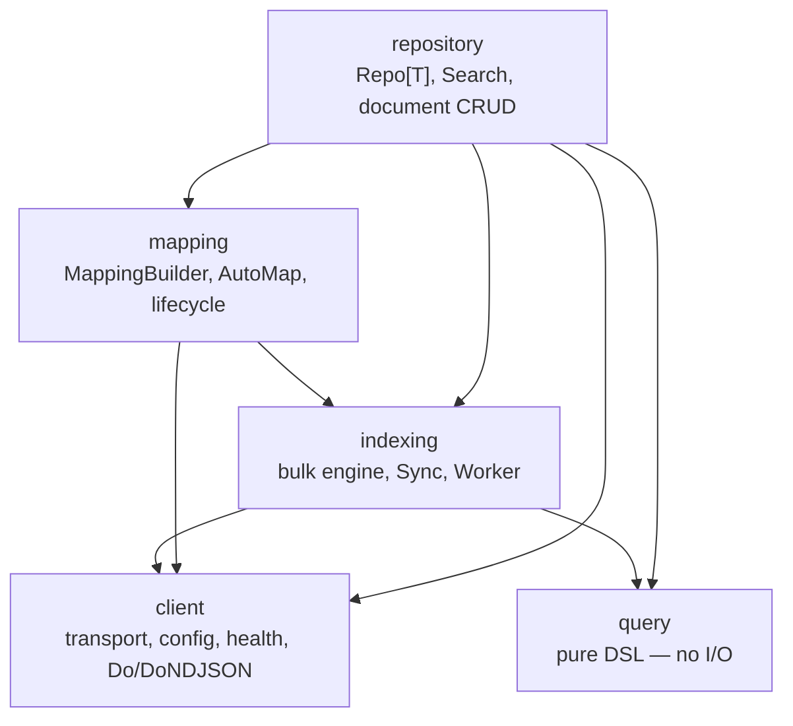
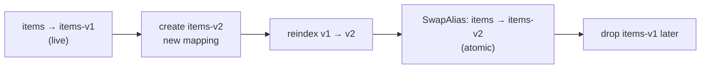

# Elasticsearch — Search, Indexing & Mappings

## Learning objectives

- Explain what the shared `database/elasticsearch` module owns, and why a service writes only domain search logic.
- Connect with `esclient.New`, and build a typed domain repository by embedding `Repo[T]`.
- Compose queries with the **query DSL** and the fluent **`NewSearch`** builder — filters, sorts, paging, aggregations, highlighting, KNN.
- Treat **mappings as code** and evolve an index safely with the blue/green alias swap.
- Index at scale with `BulkDo`, and keep an index in sync with `Sync`/`Worker`.
- Test ES code with a transport mock (no server) and against a real cluster via `ES_TEST_ADDR`.

## Prerequisites

- [Database Patterns](database-patterns) (the repository/embed idiom), [Generics](../module-1-go-fundamentals/generics), [Interfaces](../module-1-go-fundamentals/interfaces)

## Time estimate

**5 hours**

## Concepts

### Why a shared Elasticsearch layer

Postgres is the system of record; **Elasticsearch is the read model** for full-text search, geo queries, aggregations, and vector similarity — it powers the catalogue and the resource-server dataplane. Left to each service, ES access decays into hand-built query JSON, ad-hoc `go-elasticsearch` calls, and copy-pasted connection/retry code. `dx-common-go/database/elasticsearch` owns **all** of that infrastructure — connection lifecycle, TLS/retries/observability, query building, document CRUD, search, aggregations, bulk, mappings & lifecycle, deep pagination, and a generic sync worker — so a service writes only its **domain** indexing and search logic, never raw client calls or hand-assembled JSON.

> The module was restructured on 2026-07-05 from the flat `database/elastic` package into cohesive sub-packages. Same capabilities, re-homed — adopters import the sub-package they need.

### Package layout — five acyclic sub-packages



`client` and `query` depend on nothing else in the tree; the seams never reach back "up". A service composes whichever layers it needs.

| Need | Package | Key API |
|------|---------|---------|
| Connect, TLS, retries, health, metrics | `client` | `client.New(Config)`, `*Client.HealthCheck`, `*Client.Do` |
| Build queries / requests | `query` | `query.Bool/Term/Range/Match/Geo*/FunctionScore`, `query.SearchRequest` |
| Typed repository over one index | `repository` | `repository.New[T](c, index)` → `Repo[T]` |
| Run a search, decode hits | `repository` | `repository.Search`, `SearchAs[T]`, `HitsAs[T]` |
| Document CRUD, script/by-query updates | `repository` | `IndexDoc/GetDoc/UpdateDoc/DeleteDoc/Count/ScriptUpdate/UpdateByQuery` |
| Deep pagination / exports | `repository` | `Repo[T].SearchAfter`, `Scroll`, `OpenPIT` |
| Index mappings, analyzers, templates | `mapping` | `mapping.NewMapping()`, `mapping.AutoMap[T]()` |
| Create/ensure/alias/migrate indices | `mapping` | `EnsureIndex`, `EnsureAlias`, `SwapAlias`, `MigrateIndex`, `PutILMPolicy` |
| Bulk index/update/delete | `indexing` | `indexing.BulkDo`, `BulkIndexWithRetry` |
| Backfill / continuous sync from a source | `indexing` | `indexing.Sync`, `indexing.Worker` |

### Connect once, at boot

`esclient.New` pings the cluster — it fails fast on misconfiguration rather than on the first search:

```go
import (
	esclient "github.com/datakaveri/dx-common-go/database/elasticsearch/client"
)

type Config struct {
	Elastic esclient.Config `mapstructure:"elastic"`
}

c, err := esclient.New(cfg.Elastic)
if err != nil { logger.Fatal("connect elasticsearch", zap.Error(err)) }

// register readiness
hh.Register("elasticsearch", health.NewCustomChecker("elasticsearch", c.HealthCheck))
```

`client.Config` (mapstructure-loadable from your config tree) covers `addresses` (required), `username`/`password`/`api_key`, `timeout`, `ca_cert_path`/`insecure_skip_verify` for TLS, `max_retries`/`disable_retry` (transport retry on 429/502/503/504), `max_idle_conns_per_host`, and `enable_metrics` (Prometheus `dx_elastic_*`). The `Transport` field is the injection seam for tests and OTel.

### The typed repository — embed `Repo[T]`, add domain methods

The same composition idiom as the Postgres `repository.Base`: a domain repository embeds the generic typed `Repo[T]` and adds *only* domain methods. Everything generic — get/index/update/delete/count/search/bulk — is promoted.

```go
import (
	esquery "github.com/datakaveri/dx-common-go/database/elasticsearch/query"
	esrepo  "github.com/datakaveri/dx-common-go/database/elasticsearch/repository"
)

type Item struct {
	ID          string    `json:"id"`
	Name        string    `json:"name"`
	Description string    `json:"description"`
	Status      string    `json:"status"`
	Owner       string    `json:"owner"`
	CreatedAt   time.Time `json:"createdAt"`
}

type ItemRepo struct{ *esrepo.Repo[Item] }

func NewItemRepo(c *esclient.Client) *ItemRepo {
	return &ItemRepo{esrepo.New[Item](c, "items")} // "items" is the index (or an alias)
}

// domain method — infra comes from the embedded Repo[T]
func (r *ItemRepo) ActiveByOwner(ctx context.Context, owner string) ([]Item, int64, error) {
	return esrepo.SearchAs[Item](ctx, r.NewSearch().
		Filter(esquery.Term("status", "ACTIVE")).
		Filter(esquery.Term("owner", owner)).
		SortDesc("createdAt").
		Page(1, 20))
}
```

`Repo[T]` promotes `Get`/`FindByID`/`Exists`, `Index`/`Update`/`Delete`, `Count`, `Search`/`SearchAfter`, `BulkIndex`/`BulkDelete`, `ReindexTo`, and `NewSearch`. Missing documents return a `dxerrors` NotFound; `client.IsNotFound(err)` turns that into a boolean. `Client()` is the documented escape hatch for anything the typed repo doesn't wrap (raw aggregations, admin calls).

### The query DSL — structural, never string-built

Compose queries as values; every value is JSON-serialized (no string interpolation, so no injection):

```go
q := esquery.Bool().
	Must(esquery.Match("description", "solar pump")).
	Filter(
		esquery.Term("status", "ACTIVE"),
		esquery.Range("createdAt").Gte("2026-01-01").Build(),
	).
	MustNot(esquery.Exists("deletedAt")).
	Build()
```

The DSL covers full-text (`Match`, `MatchPhrase`, `MultiMatch`, `MatchBoolPrefix`), term-level (`Term`, `Terms`, `Exists`, `Prefix`, `Wildcard`, `Fuzzy`, `Regexp`, `IDs`, `QueryString`), `Range`, geo (`GeoBoundingBox`, `GeoDistance`, `GeoShape`), parent-child (`HasChild`, `HasParent`, `Nested`), scoring (`FunctionScore`, `ScriptScore`), aggregations (`TermsAgg`, `MetricAgg`, `DateHistogramAgg`, `FilterAgg`, `.Sub(...)`), `Highlight`, suggesters, and vector search (`KNN`).

**`match` vs `term` — the distinction to get right:** `Match` is analyzed (full-text — use it on `text` fields), `Term` is exact (use it on `keyword` fields, IDs, enums, and inside `Filter`). A `Term` on an analyzed `text` field silently matches nothing; that is the single most common ES mistake.

### Fluent search — `NewSearch` → `SearchAs[T]`

`Repo[T].NewSearch()` returns a `SearchBuilder` that chains bool composition, sorting, paging, aggs, highlight, suggest, KNN and PIT, then terminates with `Do`/`Count`/`SearchAs[T]`. **`Filter` clauses don't score** (cheaper, cacheable) — put exact-match and range constraints there; put the relevance query in `Must`:

```go
items, total, err := esrepo.SearchAs[Item](ctx, r.NewSearch().
	Must(esquery.MultiMatch("solar", "name", "description")). // scored relevance
	Filter(esquery.Term("status", "ACTIVE")).                 // unscored constraint
	Filter(esquery.Range("createdAt").Gte(since).Build()).
	SortDesc("createdAt").
	Highlight(esquery.Highlight{Fields: []string{"name", "description"}}).
	Page(1, 20).                                              // page/size
	TrackTotal())                                             // exact total, not capped at 10k
```

`SearchAs[T]` returns `([]T, total int64, err)` — decoded straight into your type. Lower-level terminators: `.Do(ctx)` (raw `*SearchResult`, then `HitsAs[T]`), `.Count(ctx)`.

### Document CRUD

Through the embedded `Repo[T]` (or the package functions when you don't have a repo):

```go
err := r.Index(ctx, item.ID, item)          // index/replace by id
got, err := r.Get(ctx, id)                   // *Item, NotFound if absent
err = r.Update(ctx, id, map[string]any{"status": "RETIRED"}) // partial update
err = r.Delete(ctx, id)
n, err := r.Count(ctx, esquery.Term("owner", owner)) // Term returns a query.Query

// package-level, for script/by-query updates the typed repo doesn't promote:
n, err = esrepo.UpdateByQuery(ctx, c, "items",
	esquery.Term("owner", owner), "ctx._source.status = params.s",
	map[string]any{"s": "MIGRATED"})
```

### Mappings as code, and safe evolution

Mappings are **code** — reviewed, diffed, testable — not something you click into Kibana:

```go
body := mapping.NewMapping().
	Dynamic("strict").                       // reject unmapped fields — no surprise types
	TextWithKeyword("name").                 // full-text + name.keyword for sort/agg
	Keyword("status").
	Date("createdAt").
	DenseVector("embedding", 384, "cosine"). // vector search
	Shards(1, 1).
	Build()

mapping.EnsureIndex(ctx, c, "items-v1", body)
mapping.EnsureAlias(ctx, c, "items-v1", "items") // address data via the stable alias
```

`mapping.AutoMap[T]()` derives a reviewed starting mapping from a struct. **Always read/write through the alias** (`"items"`), never the concrete index (`"items-v1"`) — that indirection is what makes zero-downtime evolution possible.

ES mappings are largely immutable: you can add a field (`PutMapping`) but not retype one. For non-additive changes, rebuild blue/green — `MigrateIndex` creates the new index, reindexes into it, and **atomically swaps the alias**:



```go
mapping.MigrateIndex(ctx, c, "items" /*alias*/, "items-v2", body, mapping.MigrateOptions{})
```

Also available: `UpdateIndexSettings` (bulk-load tuning), `PutILMPolicy` (rollover/retention for time-series indices), and composable index templates (`PutIndexTemplate`).

### Bulk, sync & workers

One-shot bulk with partial-success stats and transport retry:

```go
stats, err := indexing.BulkDo(ctx, c, "items", ops, 3 /*maxAttempts*/)
// stats: indexed / failed counts; err only on transport failure, not per-doc rejects
```

To (re)build an index from a source of truth (Postgres, an API, a file), implement the one-method `Source` interface and let `Sync` drain it in batches:

```go
// Source: Next(ctx) (batch []Doc, done bool, err error)
rep, err := indexing.Sync(ctx, c, myPostgresCursor, indexing.SyncConfig{Index: "items"})
```

For a *standing* re-sync, `indexing.Worker` runs the job on an interval, panic-safe, under an `errgroup`:

```go
w := &indexing.Worker{
	Name: "items-sync", Interval: 5 * time.Minute, RunOnStart: true,
	Job: func(ctx context.Context) error {
		_, err := indexing.Sync(ctx, c, newCursor(), indexing.SyncConfig{Index: "items"})
		return err
	},
}
g.Go(func() error { return w.Start(ctx) })
```

For sub-minute cadence or cross-replica singleton coordination, register the job with [`scheduler`](workers-cron) instead (advisory-lock singleton) — the same rule as the Postgres side.

### Deep pagination

`from`/`size` paging degrades past ~10k documents (ES has to sort everything up to the offset). For exports and infinite scroll, use `SearchAfter` (a stable cursor) or a PIT (point-in-time) snapshot:

```go
items, next, err := r.SearchAfter(ctx, q,
	[]map[string]string{{"createdAt": "desc"}, {"id": "asc"}}, // tiebreaker for stability
	after /* cursor from the previous page, nil for page 1 */, 500)
```

### Observability, health, errors

- **Metrics** (`EnableMetrics: true`): `dx_elastic_requests_total{method,status}` and `dx_elastic_request_duration_seconds{method}`.
- **Health**: `*Client.HealthCheck` — nil for green/yellow, error for red/unreachable — registered on the readiness aggregator.
- **Errors**: every non-2xx maps to the shared `dxerrors` taxonomy (404 → NotFound, 400 → Validation, 409 → Conflict, else Internal), so handlers get the right HTTP status for free — just like the Postgres translator.
- **Tracing**: `Config.Transport` is the seam — wrap with `otelhttp.NewTransport` when OTel lands.

### End-to-end — a searchable catalogue index

Putting it together the way the catalogue service does it: provision the index once, index documents, expose a search endpoint.

```go
// 1. boot: connect, provision index + alias (idempotent)
c, _ := esclient.New(cfg.Elastic)
body := mapping.AutoMap[Item]().Dynamic("strict").Shards(1, 1).Build()
mapping.EnsureIndex(ctx, c, "items-v1", body)
mapping.EnsureAlias(ctx, c, "items-v1", "items")
repo := NewItemRepo(c) // over the "items" alias

// 2. write path: index on create (ideally fed by the Postgres outbox / a Sync worker)
_ = repo.Index(ctx, item.ID, item)

// 3. read path: a handler turns allowlisted query params into a DSL search
func (h *Handler) Search(w http.ResponseWriter, req *http.Request) {
	f := parseItemFilter(req) // allowlisted params → typed filter (never raw JSON)
	items, total, err := esrepo.SearchAs[Item](req.Context(), repo.NewSearch().
		Must(esquery.MultiMatch(f.Text, "name", "description")).
		Filter(f.termFilters()...).
		SortDesc("createdAt").
		Page(f.Page, f.Size).
		TrackTotal())
	if err != nil { response.WriteError(w, err); return }
	response.WritePaginated(w, items, pagInfo(f, total), "items") // same envelope as any list endpoint
}
```

Note the shape mirrors the Postgres list endpoint exactly: allowlisted params → typed filter → builder → paginated envelope. Same discipline, different store.

### Testing ES code

Two levels, both keeping `go test ./...` green without a cluster:

- **Unit — no server.** Inject `Config.Transport` (an `http.RoundTripper`) that returns canned responses, or point `Addresses` at an `httptest.Server`. One gotcha: the official client verifies the product, so your fake **must set the `X-Elastic-Product: Elasticsearch` header** or `New` rejects it. Each package's `*_test.go` shows the pattern.
- **Integration — real cluster.** Set `ES_TEST_ADDR` to a running cluster; `repository/integration_test.go` runs against it and **skips** otherwise. (Unlike Postgres/Redis, `dxtest/containers` has no ES helper today — ES integration is the env-addr pattern.) Full detail: [Testing Strategy](../module-4-platform/testing-strategy).

### Extending the module

- **New query type** → add a pure constructor to `query` (it's just a `query.Query` map).
- **New ES operation** → a package-level `func Op(ctx, c *client.Client, …)` in the layer it belongs to (`repository` for reads/CRUD, `mapping` for schema/lifecycle, `indexing` for writes), built on `client.Do`/`DoNDJSON`. Never add a new low-level HTTP client.
- **Service-specific logic stays in the service** — field boosts, domain filters, business rules. More than ~30 lines of *generic* ES infra in a service is a PR to `dx-common-go`.

:::info[Platform connection]
`dx-common-go/database/elasticsearch/README.md` is the authoritative reference — read it alongside this page. Live consumers: **dx-catalogue-go** (dataset search, aggregations, highlighting) and **dx-dataplane-rs-go** (NGSI-LD temporal/entity queries). The write path is usually fed from Postgres via the [outbox](transactions) or a `Sync` worker, so ES stays a derived read model, never the system of record.
:::

## Exercises

1. Stand up `items` end to end in `dx-scratch-go`: `AutoMap[Item]` → `EnsureIndex`/`EnsureAlias`, an `ItemRepo` embedding `Repo[Item]`, index three docs, and a `/search` endpoint that filters by `status` and full-text-matches `name`. Prove a `Term` on the analyzed `name` field returns nothing, then fix it to `Match`.
2. Add an aggregation: top-5 owners by item count, via `TermsAgg` on `NewSearch().Agg(...).AggsOnly()`. Return it in a separate response field.
3. Evolve the mapping non-additively (add a `DenseVector` `embedding`): build `items-v2`, `MigrateIndex` from the alias, and confirm searches never saw an interruption.
4. Backfill from Postgres: implement a `Source` over a keyset cursor and run `indexing.Sync` to (re)build the index; then wrap it in a `Worker` on a 1-minute interval and watch it re-sync.
5. Write both test levels: a transport-mock unit test for `ActiveByOwner` (remember the product header), and an `ES_TEST_ADDR`-gated integration test that indexes and searches a real doc.

## Check yourself

- What does the shared module own, and what is left to the service?
- When do you use `Match` vs `Term`, and what goes in `Filter` vs `Must`?
- Why address data through an alias instead of the concrete index — and how does that enable a mapping change?
- Which pagination tool for page 3 of a UI, and which for a 2-million-row export? Why?
- How do you test ES code without a running cluster — and what header does the fake response need?

## References

- [Elasticsearch guide](https://www.elastic.co/guide/en/elasticsearch/reference/current/index.html) · [go-elasticsearch](https://github.com/elastic/go-elasticsearch)
- [query DSL](https://www.elastic.co/guide/en/elasticsearch/reference/current/query-dsl.html) · [search_after](https://www.elastic.co/guide/en/elasticsearch/reference/current/paginate-search-results.html)
- Platform: `dx-common-go/database/elasticsearch/README.md` + the five sub-packages; consumers `dx-catalogue-go`, `dx-dataplane-rs-go`; prev/next: [Transactions](transactions) → [Event-Driven Architecture](event-driven-rabbitmq)
