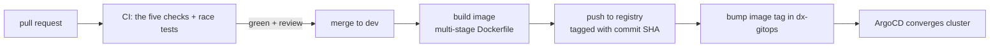

# CI/CD Best Practices

## Learning objectives

- Run the platform's full PR gate locally and understand what each check catches.
- Configure and read `golangci-lint`.
- Sketch the CI pipeline: gate → build image → push → promote via GitOps.
- Internalize the culture: CI failures are yours to prevent locally, not discover remotely.

## Prerequisites

- [Containers & Kubernetes](containers-kubernetes), [Testing](../module-2-intermediate/testing)

## Time estimate

**3 hours**

## Concepts

### The PR gate — all five, every time

A DX pull request must pass, and you run them **before pushing**:

```bash
go build ./...        # it compiles — all of it, including what you didn't touch
go test ./...         # behavior holds (CI adds -race)
gofmt -l .            # output must be EMPTY — formatting is settled law
go vet ./...          # likely bugs: printf mismatches, lost errors, copied locks
golangci-lint run     # everything else, per the repo's .golangci.yaml
```

Each catches a different class: the compiler catches type errors, tests catch behavior regressions, gofmt kills style debate, vet finds real bugs that compile fine, and the linter aggregates dozens of specialized analyzers (unchecked errors, shadowed variables, inefficient constructs, security patterns). New endpoints additionally require tests — a reviewer checks for them.

Make it automatic — a make target or pre-push hook:

```makefile
check:
	go build ./... && go test ./... && go vet ./...
	@test -z "$$(gofmt -l .)" || (gofmt -l . && exit 1)
	golangci-lint run
```

### golangci-lint — configured, not fought

Every service carries `.golangci.yaml` declaring its linter set. Two norms:

- **The config is the contract.** Don't argue with a linter in a PR thread; if a rule is genuinely wrong for the codebase, change the config in its own reviewed commit.
- **Suppressions are exceptional and justified**: `//nolint:errcheck // close error irrelevant on read path` — with the reason, always. Naked `//nolint` fails review.

### The pipeline



Two properties worth noticing:

- **Immutable, SHA-tagged images.** The artifact that passed CI is byte-for-byte what runs in every environment; environments differ only in configuration (your env-override design, again). No `:latest` in deployments — "which code is running?" must have an exact answer.
- **Deploy = Git commit.** The pipeline doesn't `kubectl apply`; it edits the GitOps repo and ArgoCD does the rest. Rollback is `git revert`. Module 4's [Deployment](../module-4-platform/deployment) page walks the repo itself.

A minimal GitHub Actions workflow for the gate:

```yaml
name: ci
on: {pull_request: {branches: [dev]}}
jobs:
  gate:
    runs-on: ubuntu-latest
    steps:
      - uses: actions/checkout@v4
      - uses: actions/setup-go@v5
        with: {go-version: '1.22'}
      - run: go build ./...
      - run: go test -race ./...
      - run: test -z "$(gofmt -l .)"
      - run: go vet ./...
      - uses: golangci/golangci-lint-action@v6
```

### The culture half

CI is a safety net, not a build server you iterate against. The platform expectation: **the gate passes locally before the PR opens**; `make dev-demo` runs green before a service image is promoted; and a red main/dev branch is everyone's top priority because every PR behind it is blocked. Push-and-pray — opening a PR to see what CI thinks — wastes reviewer attention and pipeline minutes, and it shows.

:::info[Platform connection]
The five commands are quoted verbatim in both GO-SERVICE-STANDARDS.md and CONTRIBUTING.md — same list, because local and CI are the same gate by design. Review requirements sit on top: one reviewer for a Go service PR, two for gateway config or production `dx-gitops` changes (the blast radius rule). Your [First Contribution](../capstone/first-contribution) will walk this entire path with a real change.
:::

## Exercises

1. Add `.golangci.yaml` to `dx-scratch-go` (start from a real service's config), run the linter, and fix everything. For one finding, write the justified `//nolint` instead — then decide honestly which resolution was right.
2. Wire the `make check` target and a Git pre-push hook that runs it. Live with it for the rest of the curriculum.
3. Set up the GitHub Actions gate above on your own fork/repo of `dx-scratch-go`. Open a PR with a deliberate vet error; watch it fail; fix; watch it green.
4. Extend the workflow with an image-build job that tags with `${{ github.sha }}`. (Push to a registry only if you have one handy — the tagging discipline is the point.)
5. Read `go vet`'s catalog (`go tool vet help`) and find two analyzers you didn't know existed.

## Check yourself

- What does each of the five gate commands catch that the others don't?
- Why SHA tags instead of `:latest`?
- What's wrong with iterating against CI, in one sentence about whose time it spends?
- When is `//nolint` acceptable?

## References

- [golangci-lint](https://golangci-lint.run/) · [go vet](https://pkg.go.dev/cmd/vet)
- [GitHub Actions for Go](https://docs.github.com/en/actions/use-cases-and-examples/building-and-testing/building-and-testing-go)
- Platform: `claude-docs/CONTRIBUTING.md` (PR gate, review rules); any service's `.golangci.yaml`
