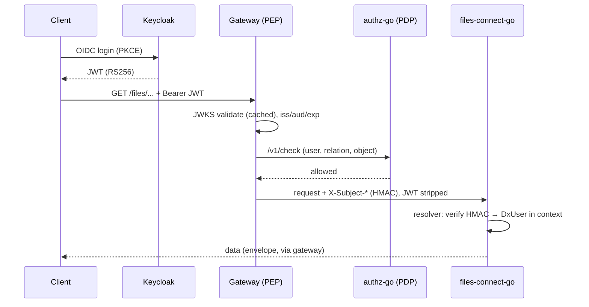
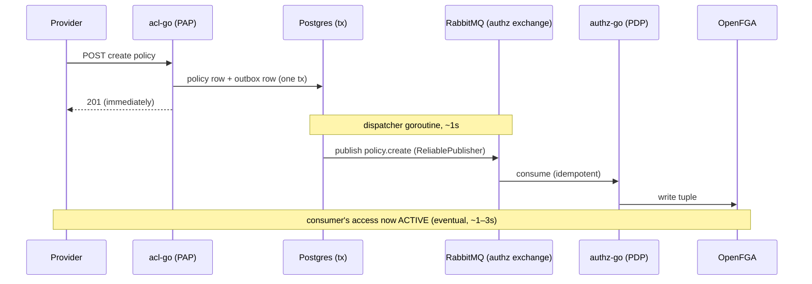

# Architecture Deep Dive

## Learning objectives

- Trace both critical flows end to end: a data request and a policy lifecycle.
- Place all fifteen Go services in their architectural roles.
- State the governing migration principle and its consequences for any code you write.
- Know the deployment shapes (central vs federated) and what SADx is.

## Prerequisites

- All of Module 3. This page assembles the pieces you now individually understand.

## Time estimate

**3 hours** — read this page, then `ARCHITECTURE.md` in full with it as your map.

## Concepts

### The two tracks, revisited with informed eyes

In Module 0 this was a picture; now every arrow has mechanics you've built. The **Java track** (Vert.x controlplane + dataplane) is the running present, direct-access, no gateway. The **Go track** is the target: one entry point, centralized trust, event-synchronized authorization. They share every datastore, which is only possible because of:

### The governing principle

> Except for the community layer, every Go service runs on the **legacy databases unchanged** — same DB, same schema, Java's Flyway remains schema owner — and **preserves the legacy API contract**.

Consequences you'll live with daily: Go repositories adapt to existing column names and shapes (not the reverse); Go services issue no DDL against legacy tables; API paths and response fields match what legacy clients already parse, with deliberate deltas documented client-facing. The endgame is database-per-service, but **contract fidelity now, isolation later** is the chosen order — it's what lets both tracks serve the same data during the years-long migration. (One known deviation — several services on a parallel ACL database pending consolidation — is tracked as the top roadmap item, which tells you how seriously the principle is taken.)

### Flow one: a data request

Every hop is a page you've done: JWT/JWKS and HMAC ([AuthN & AuthZ](../module-3-advanced/authn-authz)), the check call, the resolver chain, the context-borne user ([Context](../module-2-intermediate/context)), the envelope ([REST](../module-3-advanced/rest-api-development)).

### Flow two: a policy's life

Transactional outbox ([Transactions](../module-3-advanced/transactions)), reliable publish and idempotent consumption ([RabbitMQ](../module-3-advanced/event-driven-rabbitmq)), the consistency window and its fail-safe direction ([Distributed Systems](../module-3-advanced/distributed-systems)). Deletion runs the same pipeline with `policy.delete` → tuple removal. Beyond `policy.*`: `dx-user-go` publishes `org.member.*` into the same exchange; a `group.member.*` producer is a known open item — during the parallel run, the Go stack is the authoritative writer of authz events.

### The fleet, by role

| Role | Services |
|---|---|
| Edge / trust | gateway (PEP), authz (PDP), acl (PAP), user (Keycloak integration) |
| Domain | catalogue, marketplace, community, files-connect, credits, registry, subscription |
| Data plane | dataplane-rs (NGSI-LD over Elasticsearch), dataplane-ogc (OGC Features over PostGIS) — both early-stage ports |
| Async backbone | audit (consumer + read API), notification (consumer + dispatch) |

Parity varies (audit/authz/acl at 100%, dataplanes at ~20–25%) — `SERVICES.md` carries the live table; check it before assuming a legacy feature exists in Go.

### Deployment shapes and SADx

The same fleet deploys two ways: **central** (one cluster, one gateway — the default) or **federated** (provider-edge gateways + central control plane). **SADx** is a federated *extension* of this core — five additional services (trust anchor, trust store, dataplane proxy, adaptors), config-gated **off** by default and deferred; core DX comes first. The design consequence for you: keep core services deployment-agnostic — no assumptions that everything shares a cluster.

:::info[Platform connection]
This page *is* the platform. Verify rather than believe: run `make dev-demo` once more and, this time, narrate to yourself which numbered arrow of which diagram each check exercises. If you can do that unaided, milestone M4 is within reach.
:::

## Exercises

1. Reproduce both sequence diagrams **from memory** (paper is fine). Compare against this page; study the arrows you missed.
2. In `ARCHITECTURE.md`, find one design decision this page didn't cover, and write a three-sentence summary of its rationale.
3. Trace a *revocation*: DELETE policy → which rows, which event, which tuple, and measure the deny-latency with your script from [Distributed Systems](../module-3-advanced/distributed-systems).
4. Pick a hypothetical feature ("providers can pin a dataset version") and write down: owning service, new endpoints (with exact paths), events published, tuples touched, consistency window and who observes it. This is the design exercise every real ticket starts with.

## Check yourself

- Recite the governing principle and its three daily consequences.
- Why does policy creation return 201 *before* access works, and why is that acceptable?
- Which services may write DDL, and to what?
- What is SADx in one sentence, and what does its deferral mean for core code?

## References

- Platform: `claude-docs/ARCHITECTURE.md` (read fully now), `MIGRATION.md` §0 (the principle), `SERVICES.md` (parity table)
