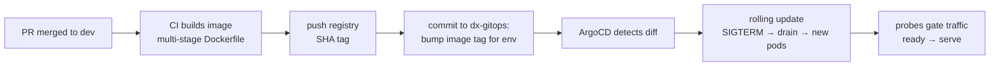

# Deployment & GitOps

## Learning objectives

- Follow a change from merge to production: image build → registry → GitOps commit → ArgoCD convergence.
- Understand the dx-gitops repository: environments, ApplicationSets, per-service config.
- Know your responsibilities as a service developer in a deployment — and during a rollback.

## Prerequisites

- [Containers & Kubernetes](../module-3-advanced/containers-kubernetes), [CI/CD](../module-3-advanced/cicd)

## Time estimate

**2.5 hours**

## Concepts

### GitOps in one paragraph

Nobody runs `kubectl apply` at production. The desired state of every environment lives in a Git repository — **`dx-gitops`** — and **ArgoCD** continuously reconciles the clusters to match it. Deploying is a commit; auditing deployments is `git log`; rolling back is `git revert`. Drift (someone hand-editing the cluster) is detected and reverted, which converts "what's actually running?" from archaeology into a Git query.

### The path of a change, end to end

Steps F and G run on machinery *you* built into the service: graceful shutdown ([HTTP](../module-3-advanced/http-servers-middleware)) makes the drain clean, and the readiness probe ([Observability](../module-3-advanced/observability)) keeps traffic off a pod whose dependencies aren't up. A service missing either deploys badly — which is why both are standards, not suggestions.

### Inside dx-gitops

The shape (details in `claude-docs/GITOPS.md`): per-**environment** definitions (dev → staging → production), and **ApplicationSets** — ArgoCD's template mechanism that stamps out one Application per service per environment from a single definition, so adding a service to an environment is adding an entry, not copying YAML. Per-service, per-env files carry the image tag and the environment's config values — the same env-var names your `dxconfig` struct reads, now sourced from ConfigMaps/Secrets ([the K8s page's](../module-3-advanced/containers-kubernetes) ConfigMap → env → viper chain, completing).

Promotion through environments is deliberate, not automatic: the image SHA that soaked in dev is the *same* SHA promoted to staging and production — environments differ only in their config files. Remember the review rule from [CI/CD](../module-3-advanced/cicd): production `dx-gitops` changes take **two** approvers.

### Your responsibilities as a service developer

You don't operate ArgoCD, but a deployable service is your job:

- **Before promotion**: gate green, `make dev-demo` green, README current (env vars especially — the gitops config is written from it).
- **New config key?** It must have a sane default or be added to every environment's config *before* the image lands — a missing required env var is a crash-loop, discovered at deploy time, attributed to you.
- **Schema changes?** Coordinate: additive-only, applied before the code that needs them (the schema-ensure pattern handles the service's own tables; anything else is a Flyway/DBA conversation per the governing principle).
- **After deploy**: watch your service's logs/metrics in the target environment until you've seen it take real traffic. "Merged" is not "done".
- **Rollback**: if your deploy misbehaves, reverting the gitops commit restores the previous SHA in minutes. Design changes to *be* revertable: code that can run against both old and new schema versions, events consumers can handle in both old and new shapes ([Distributed Systems'](../module-3-advanced/distributed-systems) versioned payloads, paying off).

:::info[Platform connection]
Read `claude-docs/GITOPS.md` now for the concrete repository layout and workflow. Then the capstone-adjacent exercise: `dx-gitops` step 5 from the [new-service checklist](repo-structure-workflow) — you'll draft (not apply) those files for your capstone service, which is the difference between understanding GitOps and having read about it.
:::

## Exercises

1. Trace a real deployment backwards: pick any running Go service, find its image tag in the compose/gitops config, and match it to a commit in the service's history.
2. Draft the full dx-gitops addition for `dx-scratch-go`: env file with every env var your config reads (cross-check against your `Config` struct — this audit *always* finds a forgotten key), and the ApplicationSet entry, modeled on an existing service's.
3. Failure drill on paper: your newly deployed version crash-loops on a missing env var. Write the incident timeline: how you'd notice, diagnose (which kubectl/ArgoCD views), and resolve — both the fast path (revert) and the correct path (fix config, redeploy).
4. Backward-compatibility drill: you're renaming a JSON field in an event payload. Write the three-step deployment sequence that never breaks a consumer (hint: publish both → migrate consumers → retire old).

## Check yourself

- Why is `git revert` a complete rollback story here?
- What two pieces of *service code* make rolling updates safe, and where did you build them?
- Why must the same SHA move through environments?
- A new required config key: what's the deployment-safe sequence?

## References

- [ArgoCD docs](https://argo-cd.readthedocs.io/) · [GitOps principles](https://opengitops.dev/)
- Platform: `claude-docs/GITOPS.md` (required), `CONTRIBUTING.md` (promotion gates)
